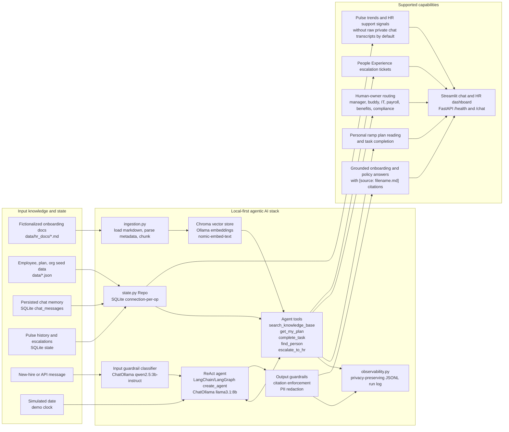
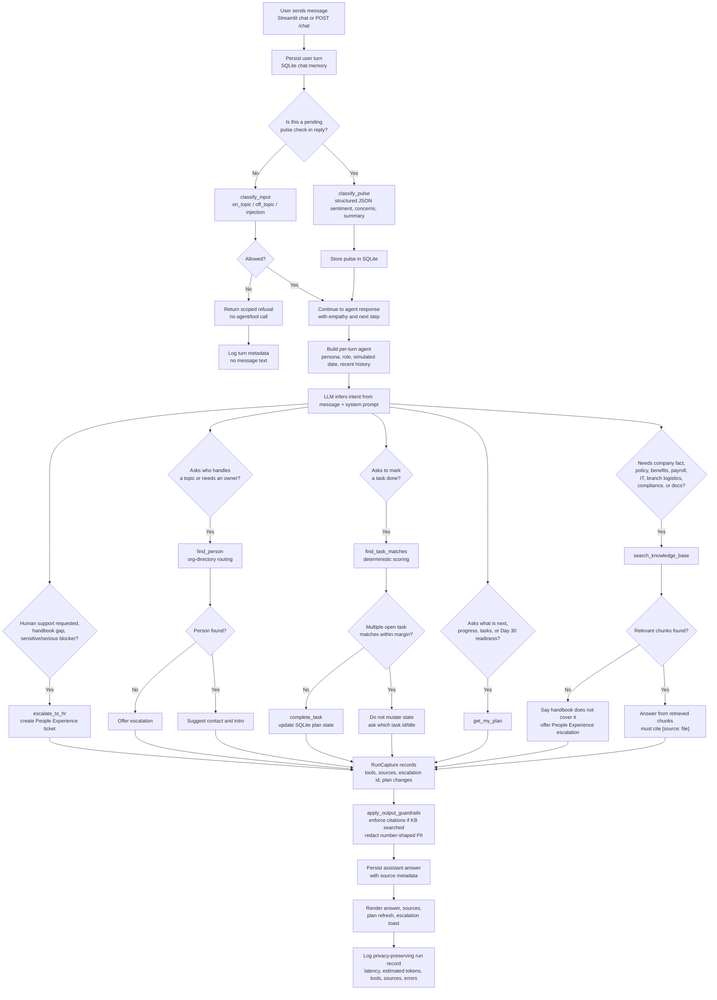
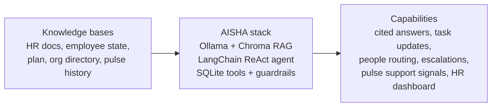

# AISHA Architecture Diagrams

Use these Mermaid diagrams in the technical write-up, module checklist, or
presentation deck. They describe the current implemented prototype, not future
production integrations.

AISHA is an educational capstone prototype for a fictionalized BDO onboarding
story. It is not affiliated with, endorsed by, or representative of BDO
Unibank.

## System Architecture

### What This Shows

| Layer | Implemented modules | Module checklist evidence |
|---|---|---|
| Knowledge input | `data/hr_docs/*.md`, `data/*.json`, SQLite state | RAG, memory, state |
| Retrieval processing | `ingestion.py`, `retriever.py`, Chroma, Ollama embeddings | RAG with citations |
| Agent reasoning | `agent.py`, ChatOllama, LangChain/LangGraph ReAct loop | Prompt engineering, ReAct agent |
| Tools | `tools.py` internal tools over KB, plan, org, escalation state | Tool use, disambiguation |
| Guardrails | `guardrails.py`, pulse JSON parsing in `pulse.py` | Structured outputs, guardrails |
| Surfaces | `app.py`, `api.py`, `service.py` | Chat UI, REST API |
| Monitoring | `observability.py`, `data/observability.jsonl` | Basic LLMOps monitoring |

## Agentic AI Turn Flow

### Trigger Rules In Plain English

- **Input guardrail triggers before the agent** for every normal chat message.
  Off-topic and prompt-injection messages receive a refusal without tool use.
- **Pulse check-in replies bypass the topic classifier** because they are
  expected to be emotional or broad work reflections. They are scored by
  `pulse.classify_pulse`, stored, then the agent can respond supportively.
- **RAG is required** whenever the answer makes factual claims about company
  policy, benefits, pay, IT, branch logistics, compliance learning, or handbook
  content.
- **Plan tools trigger** when the user asks what to do next, asks about Day 30
  readiness, checks progress, or asks to complete a task.
- **Disambiguation blocks mutation** when a fuzzy task request matches multiple
  open tasks too closely. AISHA asks one clarifying question instead of marking
  the wrong item complete.
- **People routing triggers** when the user asks who handles a blocker, system,
  process, manager/buddy touchpoint, or workplace topic.
- **Escalation triggers** when the handbook has no answer, the user explicitly
  asks for human help, or the issue sounds sensitive or serious.
- **Output guardrails always run after the agent**. If the KB was searched but
  the model forgot citations, citations are appended from retrieved sources; if
  no sources exist, AISHA falls back to a handbook-gap answer.
- **Observability logs metadata only**: route, models, latency, estimated token
  counts, guardrail category, tools used, sources, escalation id, plan changes,
  and errors. It deliberately does not log raw chat text.

## Slide-Friendly Short Version

One-line speaker note:

> AISHA is agentic because it does not only answer questions; it retrieves
> grounded context, reads and updates ramp state, routes to human owners,
> initiates pulse check-ins, escalates gaps, and logs privacy-preserving
> operational signals.
