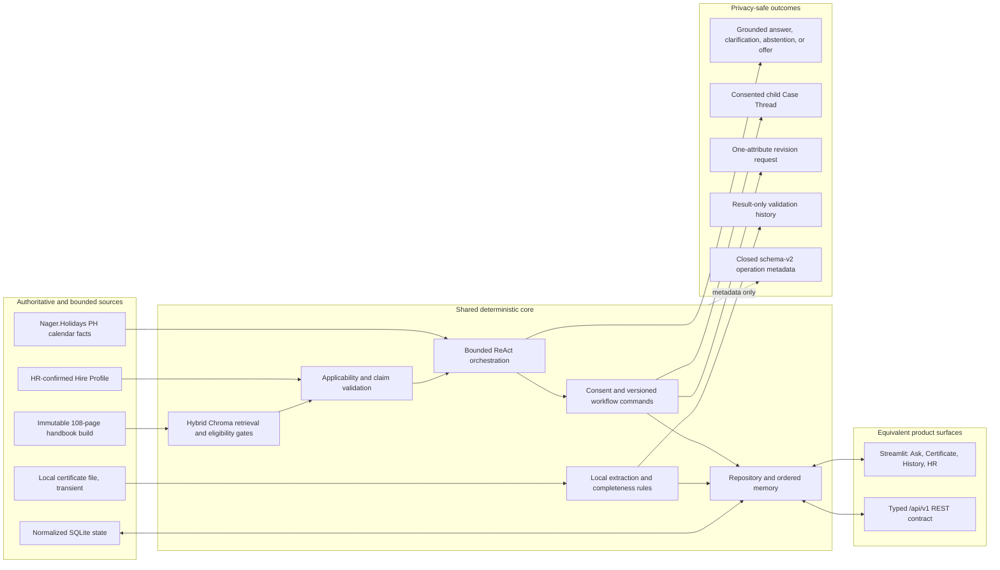
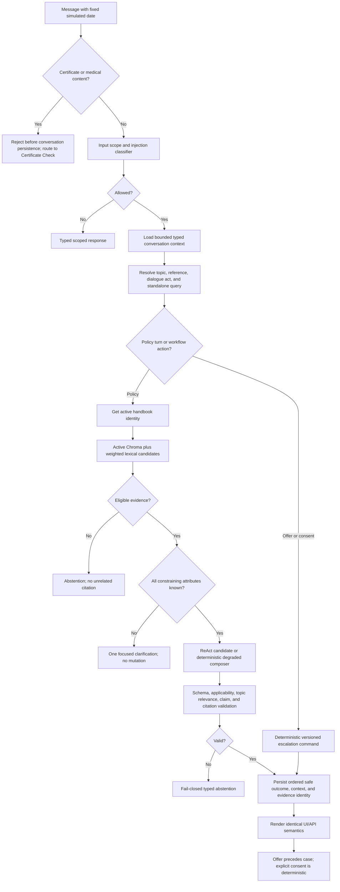
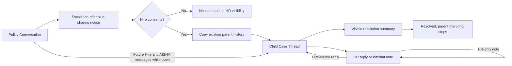
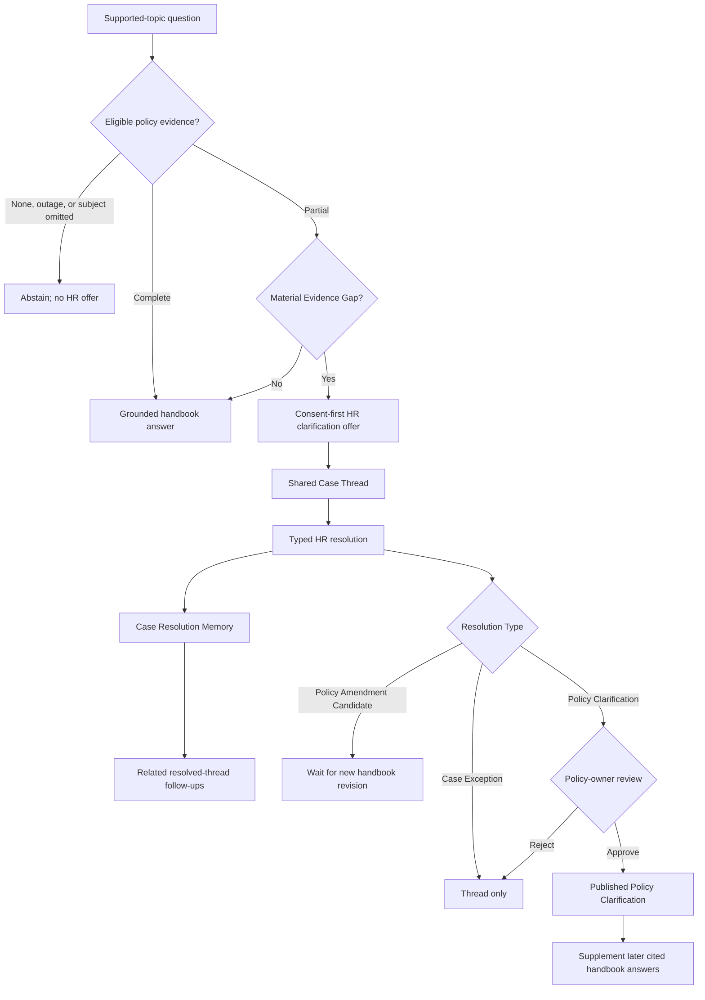
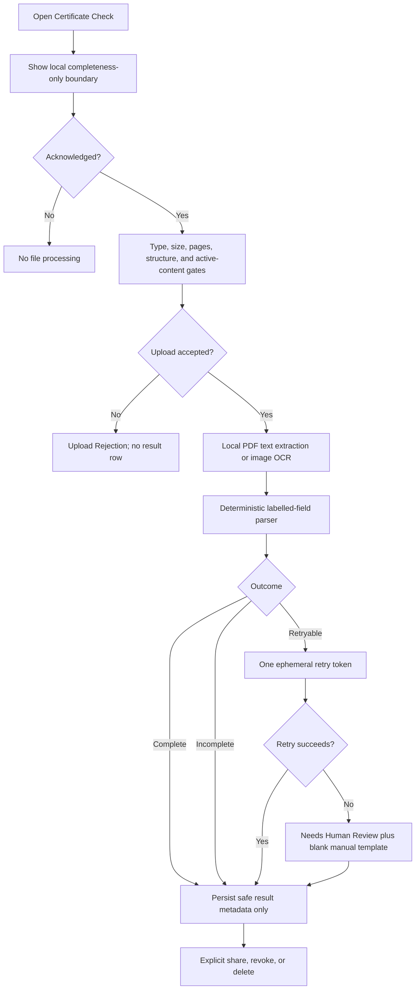
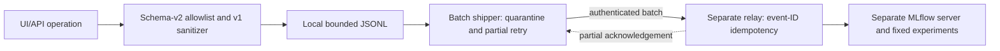

# AISHA Architecture Diagrams

These diagrams describe the implemented AISHA v1.0 educational capstone. AISHA covers only Payroll, Resource Access, and HR Policies for one fictional Hire, Alyssa Reyes. It is not affiliated with or endorsed by BDO Unibank and does not use real employee data.

## System boundary

The policy answer is not whatever text a model happens to emit. Retrieval first resolves the active immutable build, combines vector and lexical candidates, then rejects records that fail version, integrity, authority, status, topic, or applicability gates. The policy core validates every material claim and citation before either surface can render it. The model can choose among bounded tools, but it cannot approve a profile revision, manufacture consent, decide certificate authenticity, or write arbitrary SQL.

## Policy turn flow

Evidence exposed to users is structured identity—policy ID, revision, handbook version, page, and artifact hashes—not stored raw snippets or model-authored filename citations. Conversation history is server owned and ordered. Safe typed turn state resolves follow-ups across restarts, while conversation statements never become authority for Hire Profile attributes. A wrong-topic citation is invalid even when its page identity was retrieved.

## Consented Case Thread flow

The left navigation nests each Case Thread beneath its parent and shows text status and unread count. HR never queries the Policy Conversation tables through its product surface; the case workflow owns the copied thread, participant permissions, versions, events, and notifications. Certificate content and unrelated conversations never enter this path.

## Evidence-gated clarification and memory

The model never decides that it is merely “unsure.” `EvidenceGapAssessor` requires eligible partial evidence and a closed gap type. Reviewed clarification attribution remains separate from handbook citations, and the active handbook remains the policy authority.

## Certificate flow

File bytes, filenames, MIME details, extracted text, diagnosis, field values, confidence maps, and document fingerprints are not part of public history. The installation fingerprint key is stored outside SQLite with restrictive permissions. A `Complete` result is only a local structural completeness result; it is not authenticity, medical assessment, approval, or submission.

## Protected telemetry topology

The telemetry side channel never changes a product outcome. Event IDs are random and retry-stable. Only closed route, operation, outcome, count, latency, and experiment values are accepted; Hire identifiers, conversation text, policy text, certificate content, extracted values, diagnosis, filenames, fingerprints, and raw errors are denied. Local retention is bounded to seven days and 100 MB.

## Deployment boundary

The Docker image is Python 3.12 Linux, runs as non-root UID 10001, includes Tesseract English, and persists `/app/data` for SQLite and the separate installation key. The container smoke starts both Streamlit and FastAPI, checks their health, replays the six-turn payroll/context/escalation regression with zero wrong-topic citations, and proves a synthetic `Complete` certificate result. Nager is isolated from health; all private Hire, conversation, policy, document, OCR, and medical data remain local.
