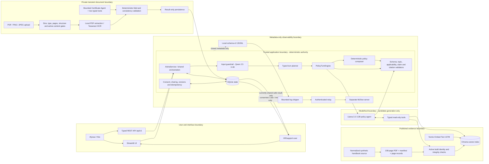
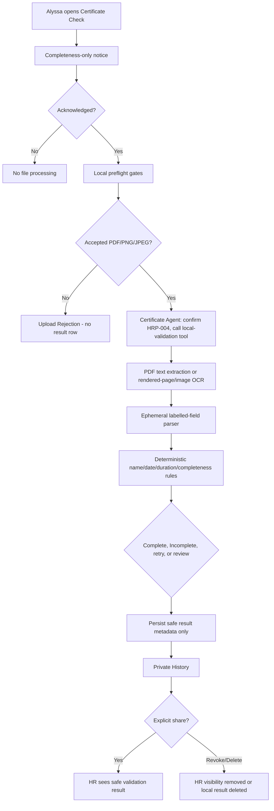

# De La Salle University-Manila

## College of Computer Studies

**Introduction to Agentic AI, STAI100**  
**Final Capstone**

# AISHA: AI Support for Hires and Associates

### A local-first, evidence-grounded onboarding assistant with consent-controlled policy support and OCR-based certificate checking

**Local models used in the verified CPU-only configuration**  
Llama 3.2, 3.2B parameters (policy and Certificate Agents)  
Qwen 2.5 Instruct, 3.1B parameters (input guardrail)  
Qwen 2.5 Instruct, 7.6B parameters (evaluation-only LLM judge)  
Nomic Embed Text, 137M parameters (handbook embeddings)

**Submitted by**  
Bon Windel Aquino  
Jose Miguel Espinosa  
Karl Matthew Dela Cruz  
Johann Casio

> **Administrative confirmation required before submission.** The four names above are recovered from the Midterm Capstone cover. Current final-project ownership documents name Bon Aquino, Jose Miguel Espinosa, and Johann Casio, but omit Karl Matthew Dela Cruz. The final roster, spelling/capitalization, component ownership, and presentation responsibilities must be confirmed by the team.

**Submitted to**  
Kristine Kalaw

**Term**  
Term 3, Academic Year 2025-2026

**Submission date**  
15 August 2026

---

## Fictionalized educational-use notice

AISHA is an educational capstone prototype. It is not affiliated with, endorsed by, or representative of BDO Unibank. It has no access to real BDO employees, documents, systems, or internal data. Every person, policy, profile, record, conversation, certificate, and measurement in this report is synthetic or fictionalized. AISHA is intended as employee support, not employee surveillance. In the demonstrated workflow, HR/support users see support signals and information that the Hire explicitly shares; they do not receive private policy-chat transcripts or medical-document contents by default.

---

## Executive summary

New hires often lose time because an answer is distributed across a handbook, an applicability condition, and a system owner. The Midterm Capstone explored that broad coordination problem through questions, tasks, people routing, escalation, pulse checks, memory, guardrails, API access, and observability. The Final Capstone narrows that foundation into a defensible proof of concept (PoC): evidence-grounded support for exactly Payroll, Resource Access, and HR Policies, plus a separate local medical-certificate completeness workflow.

The focused journey begins when Alyssa Reyes, one fictional Hire, asks a bounded onboarding question. AISHA resolves the Active Handbook, retrieves eligible page-native evidence, evaluates applicability against four HR-confirmed attributes, and returns one typed outcome: Grounded Answer, Clarification Request, Abstention, or Escalation Offer. An offer is not a case. Only explicit consent creates an HR-visible child Case Thread. In a separate Certificate Check destination, Alyssa may acknowledge a local-completeness notice and upload a PDF, PNG, or JPEG. Local text extraction or Tesseract OCR feeds deterministic field and consistency rules. A bounded Certificate Agent may call only two typed tools; it never receives the file, filename, OCR text, or extracted values. Only a safe result can be shared with HR, and sharing can be revoked.

Evidence is strong for deterministic contracts and modest for live-model quality. The main suite passed 254 of 254 tests; the relay suite passed 6 of 6. A frozen 60-case synthetic benchmark selected P3 with a Locked Composite Safety Score of 0.987481 and zero hard failures, but ran in `offline_deterministic_contract` mode. A six-case local judge passed fallback-generated candidates, not live-agent candidates. A clean synthetic OCR probe extracted 33 of 33 labelled field slots, and one live Certificate Agent run completed in 18.922 seconds. These small samples do not establish real-document accuracy.

The principal limitation is the live policy agent. In a fresh reproduction, the full local payroll turn reached the Qwen guardrail, Ollama embeddings, active Chroma collection, and Llama agent, but completed in 85.338 seconds and was recorded as degraded. The Llama-only run took 34.224 seconds, retrieved the wrong payroll policies (`PAY-003` and `PAY-006`), and emitted schema-invalid JSON. The validator rejected it, and the deterministic fallback returned the correct `PAY-001` answer. This demonstrates that the safety boundary worked; it does not demonstrate that the live Llama policy agent answered correctly.

AISHA therefore supports a narrow conclusion: it demonstrates an offline-capable, privacy-conscious onboarding-support PoC combining retrieval, agent tools, deterministic validation, consent, OCR, persistent state, and observable execution. It does not prove production readiness or a measured time-to-ramp improvement; those require a real pilot with explicit time, volume, and outcome units.

---

# 1. Business case and value proposition

## 1.1 Onboarding is a coordination problem

Organizational socialization research describes onboarding as the process through which newcomers acquire the information, role clarity, task mastery, and social acceptance needed to become effective insiders. A recent meta-analysis synthesized 256 studies and reinforced that newcomer adjustment involves both information and human support, rather than one orientation event (Bauer et al., 2025). Earlier longitudinal evidence likewise found that newcomers obtain different kinds of knowledge from different sources and that supervisors, coworkers, task mastery, and role mastery matter to assimilation (Ostroff & Kozlowski, 1992).

That pattern explains AISHA's business problem. A new Hire may find a payroll page yet still not know whether it is current, whether it applies to a particular employment classification, or where an unspecified official route lives. A generic chatbot can summarize text, but it cannot safely resolve version identity, profile authority, consent, persistent workflow state, and document privacy through one prompt. AISHA treats each question as a small coordination decision: establish scope, locate eligible evidence, determine applicability, communicate uncertainty, and route to a human only when the evidence supports that route.

The fictional persona is Alyssa Reyes, represented as a newly hired Management Trainee and Branch Banking Associate. The midterm story described a broad Day 30 readiness goal. The final PoC retains that human motivation but narrows the demonstrable task: help Alyssa resolve bounded questions in Payroll, Resource Access, and HR Policies, and perform a local structural check of a medical-certificate file without turning the assistant into an approval authority or surveillance surface.

## 1.2 Friction addressed by the final PoC

AISHA addresses five specific frictions:

1. **Source uncertainty.** A plausible answer is insufficient unless it maps to the active synthetic handbook by policy ID, revision, version, page, and artifact identity.
2. **Applicability uncertainty.** A rule may depend on Role Key, Department Key, Employment Classification, or Work Site. Conversation text cannot silently rewrite those facts.
3. **Escalation ambiguity.** A request for “a human” should not automatically expose a conversation or create HR work. Eligible partial evidence and a material Evidence Gap must exist before an offer appears.
4. **Sensitive-document handling.** A certificate image requires local document processing and deterministic validation, not a generic chat upload that could leak medical information into memory or logs.
5. **Operational trust.** The team needs to know which path ran, how long it took, whether it degraded, and which bounded tools were used—without storing private content as telemetry.

Privacy is part of the value proposition because workplace AI can feel managerial even when it is introduced as assistance. Survey research on emotional AI and non-human management found substantial concern about being managed by AI and meaningful cross-cultural differences in attitudes (Mantello et al., 2023). Human-centered AI similarly argues for designs that combine useful automation with meaningful human control (Shneiderman, 2020). AISHA operationalizes those ideas through explicit consent, role-separated surfaces, minimal persistence, and human authority over consequential decisions.

## 1.3 Why the scope narrowed

The midterm proved that a broad support loop could be assembled. The final specification, however, asks whether the project can do one important thing well and whether CV/DS is a first-class part of that solution. The team therefore removed the broad production story around ramp tasks, pulse/risk monitoring, multi-employee directories, and general onboarding behavior. The narrowed system is easier to falsify: a policy answer is either supported and applicable or it is not; a case is either consented or it is not; a certificate result either contains only safe metadata or it violates the boundary.

This is a stronger PoC because failure states are part of the product. Missing evidence leads to abstention. One missing deciding attribute leads to one clarification. Eligible partial evidence can lead to an offer, but consent remains separate. Schema-invalid model output is rejected. OCR uncertainty leads to one retry or human review, not a guessed medical conclusion.

## 1.4 Value proposition with units of measurement

The project has no real-user study, no observed HR labor baseline, and no production cost data. It therefore makes no peso-savings, productivity-gain, or time-to-ramp percentage claim. Its value proposition is a measurable hypothesis:

> **For a bounded set of onboarding questions, AISHA may reduce the elapsed and human handling time required to reach a source-backed next step while preserving consent and privacy boundaries.**

The following estimation model can be populated in a future pilot. Each variable has an explicit unit:

| Variable | Unit | Basis required |
|---|---:|---|
| `H` | Hires per month | Actual monthly onboarding count |
| `Q` | supported questions per Hire per week | Observed question log, aggregated without private text |
| `W` | onboarding weeks per Hire | Pilot definition of onboarding window |
| `T_before` | human-handling minutes per question | Time study before AISHA |
| `T_after` | human-handling minutes per question | Time study with AISHA, including escalations |
| `R` | currency per support hour | Fully loaded, organization-approved costing basis |

Estimated support hours released per month:

`H × Q × W × (T_before − T_after) ÷ 60 minutes per hour`

Estimated monthly labor-value capacity:

`support hours released per month × R currency per support hour`

These equations are not results. Every input remains **[TEAM/PILOT TO MEASURE]**. A credible pilot would also report median time to supported resolution in minutes, 90th-percentile time to supported resolution in minutes, days to resolve an escalated blocker, clarification rate as a percentage of eligible questions, consented-escalation completion rate as a percentage of offers, and repeated-question rate per Hire per week.

Measured prototype outcomes are reported separately: test cases passed, benchmark cases, OCR field slots extracted, and local execution latency in seconds. Potential value remains an estimate until a real pilot supplies baseline and post-intervention measurements. Intangible benefits—clearer provenance, consistent escalation boundaries, greater user agency, and reduced pressure to disclose private information—are valuable but are explicitly non-monetized in this report.

---

# 2. Midterm-to-final evolution

The final project is a continuation, not a rewrite of history. The midterm established the human story: a capable new Hire can still be lost when policies, systems, owners, and workplace expectations are scattered. It also established the local-first stack and an early “support, not surveillance” position. The final retained those foundations while replacing broad behavior with narrower contracts.

| Dimension | Midterm foundation | Final PoC state | Why the change matters |
|---|---|---|---|
| Product scope | Broad onboarding loop: handbook Q&A, tasks, people routing, escalations, pulse checks, memory, API, observability | Exactly Payroll, Resource Access, HR Policies, plus separate Certificate Check | Makes outcomes and failure modes testable within capstone time |
| Policy evidence | Markdown chunks and filename citations | Active immutable 108-page handbook; policy/version/page/artifact identity; integrity and applicability gates | A citation now represents verified provenance, not merely retrieved text |
| Applicability | Persona-aware prompting and seeded records | Four HR-confirmed attributes with versioned revision workflow | Chat cannot become profile authority |
| Agent authority | General tool-using assistant | Typed Agent Plan, bounded read-only tools, deterministic validation and mutation authority | Separates agentic reasoning from consequential control |
| Human escalation | Agent could route or file escalation | Eligible Evidence Gap → offer → disclosure → explicit consent → child Case Thread | Prevents automatic exposure and unnecessary HR work |
| HR visibility | Support dashboard with signals and some drill-down | Consented case copies only, explicit information requests, private HR notes, currently shared result metadata | Strengthens support-not-surveillance boundary |
| Sensitive documents | Not a core midterm workflow | Local PDF/image preflight, OCR/text extraction, deterministic certificate validation, bounded Certificate Agent | Satisfies mandatory CV integration as part of the core journey |
| Memory | General chat/task/pulse persistence | Ordered Policy Conversations, case-scoped memory, reviewed clarification reuse, result-only certificate history | Prevents private or exceptional facts from becoming global policy |
| Retrieval | Basic local Chroma RAG | Immutable build activation, dense + lexical retrieval, topic/authority/status/integrity/applicability gates | Handles wrong-topic and stale-evidence failure modes |
| Evaluation | Targeted unit tests and small sanity checks | 254-test suite, relay suite, 60-case benchmark, six-turn regression, OCR probes, local judge, live CPU reproductions | Separates contract evidence from live model quality |
| Runtime | Local Ollama and Streamlit | Explicit CPU-only (`num_gpu=0`) across chat, embeddings, and judge; typed UI/API health states | Makes hardware constraint and degradation visible |

Several midterm features were intentionally removed from the current production story: ramp plans, task completion, pulse checks, risk labels, general employee directories, and unversioned endpoints. Historical discussion belongs to the midterm baseline, not the current capability list. The final does not claim that those removed features continue to operate.

The redesign also introduced three deeper ideas. First, the Active Handbook is a published artifact with an identity, not a loose folder. Second, an HR answer can be reused outside one case only after a separate policy-owner review; a case exception stays in its thread, while an amendment candidate waits for a new handbook revision. Third, Certificate Check is a privacy-separated product destination. These changes make the PoC narrower while making its claims more defensible.

---

# 3. Review of Related Literature and model selection

## 3.1 Review scope and method

This section is a focused scoping review, not a systematic review or meta-analysis. The technical question was: *Which document-text extraction approach best fits a three-hour, CPU-only, local demonstration that must process small synthetic certificate PDFs and images without sending content to a hosted service?* The comparison considered local/offline operation, CPU feasibility, installation burden, input support, expected accuracy on clean printed labels, privacy implications, latency, resource requirements, and integration effort.

Primary papers and official documentation were preferred. Sources were included when they described an implemented OCR/document-understanding method, an official runtime contract, or a directly relevant governance/business finding. Marketing-only accuracy claims, unverified benchmark summaries, and sources that did not disclose task context were excluded. The search was performed on 15 August 2026 across publisher/DOI pages, arXiv, OpenReview, NeurIPS proceedings, official project documentation, NIST, and official cloud documentation. Appendix F records the search strings and limitations.

## 3.2 Business and human-centered foundation

Onboarding research supports the premise that successful adjustment requires information, task mastery, role clarity, and social support rather than one generic information dump (Bauer et al., 2025; Ostroff & Kozlowski, 1992). This does not prove that AISHA improves time-to-ramp. It does justify measuring resolution and coordination rather than counting chatbot messages.

Human-centered AI provides the second design foundation. Shneiderman (2020) argues that high automation and high human control can coexist. NIST's AI Risk Management Framework treats trustworthy AI as a lifecycle and socio-technical problem organized around govern, map, measure, and manage functions (Tabassi, 2023). AISHA's deterministic gates, human authority, explicit limits, and staged evaluation are a small implementation of that position. In an HR setting, Mantello et al. (2023) further show why monitoring and emotional inference can provoke concern. AISHA therefore avoids individual risk scoring and raw-transcript access in its final scope.

## 3.3 RAG and tool orchestration

Retrieval-augmented generation (RAG) combines a parametric language model with an external non-parametric knowledge source. Lewis et al. (2020) motivated RAG partly through problems of knowledge updating and provenance. AISHA adopts that architectural idea but adds deterministic authority, integrity, topic, and applicability gates because retrieval alone does not prove that a policy is current or relevant.

ReAct interleaves language-model reasoning with actions in an environment (Yao et al., 2023). AISHA uses a bounded variation: the model can select typed read-only tools and produce a candidate structured outcome, while deterministic code revalidates the evidence and retains every mutation. Observable action names and tool outputs are sufficient for evaluation; private chain-of-thought is neither requested nor stored.

## 3.4 OCR and document-understanding alternatives

OCR converts visible text in an image into machine-readable text. It does not determine whether a document is genuine, clinically valid, or acceptable to HR. In AISHA, OCR output is only an ephemeral input to a labelled-field parser and deterministic completeness rules.

| Approach | Local/offline and CPU fit | Installation and inputs | Accuracy/resource considerations | Privacy and PoC fit |
|---|---|---|---|---|
| **Tesseract 5.x (selected)** | Fully local; mature CPU execution; English trained data available | Native package plus `pytesseract`; reads PNG/JPEG/TIFF and other images. AISHA converts image-only PDF pages to images because Tesseract does not read PDFs directly | Strong fit for clean printed labels; scan quality, skew, typography, handwriting, and language variation can reduce accuracy. Lightweight compared with transformer stacks | Best fit for the fixed English synthetic form, offline demo, simple container packaging, and strict no-egress requirement |
| **EasyOCR** | Local and can run with `gpu=False` | Python/PyTorch stack; 80+ languages; convenient detection + recognition pipeline | More flexible for scene text and multilingual use, but PyTorch increases package size and CPU start-up/runtime burden | Reasonable alternative if multilingual or irregular-layout images became central; unnecessary for the controlled capstone form |
| **PaddleOCR / PP-OCR** | Local CPU packages and lightweight model families are available | PaddlePaddle plus PaddleOCR; supports broader OCR and document pipelines | PP-OCR literature emphasizes small recognition models and efficiency; current suites add more dependencies and configuration options | Strong future candidate for noisier, multilingual, or layout-heavy forms; higher integration risk within the capstone's short local setup window |
| **LayoutLMv3 and related transformers** | Can run locally but typically require materially more memory, model files, and task-specific fine-tuning/evaluation | Combines text, image, and layout; suited to form understanding and document QA | Research reports strong results across text- and image-centric Document AI tasks, but the model is broader than simple labelled-field extraction | Valuable when spatial layout and generalized entity extraction are core; excessive for eleven known synthetic labels and CPU demo constraints |
| **Donut / OCR-free document transformers** | Local inference is possible, but model size, training/fine-tuning, and CPU latency are less attractive for this PoC | Image-to-structured-output architecture without a separate OCR engine | Avoids OCR error propagation but transfers risk to a larger learned end-to-end model; domain adaptation and evaluation remain substantial | Interesting for diverse real forms, but less transparent and harder to bound than OCR + deterministic parsing in a short demo |
| **Managed cloud Document AI** | Requires network and a cloud account; not offline | Broad file/processor support and scalable hosted OCR/extraction | Often high quality and operationally convenient; introduces per-page cost, service dependency, data-processing configuration, and vendor governance | Rejected for the local-first privacy story and offline demonstration, not because cloud OCR is intrinsically unsuitable |

Tesseract's original engine was described by Smith (2007), while current official documentation identifies Tesseract 5 as an open-source OCR engine with LSTM-based recognition and broad language support (Tesseract OCR, n.d.). EasyOCR's official project documents CPU-only operation and broad script support (JaidedAI, n.d.). PP-OCR provides an open lightweight alternative; its original report describes a 2.8M-parameter alphanumeric recognizer, although a complete modern PaddleOCR pipeline includes detection, recognition, and runtime dependencies beyond that one number (Du et al., 2020). LayoutLMv3 and Donut represent two transformer directions: multimodal OCR-dependent document understanding and OCR-free document understanding, respectively (Huang et al., 2022; Kim et al., 2022). Google Document AI represents the managed-service class and is explicitly cloud based (Google Cloud, n.d.-a).

## 3.5 Selection rationale and evaluation implication

Tesseract was selected because the final PoC has known English labels, small files, local processing, CPU-only execution, and a three-hour demonstration constraint. Its limitations are easier to communicate and surround with deterministic rules. PDF text layers are extracted locally with PyMuPDF; image-only PDF pages are rendered locally and passed to Tesseract. PNG and JPEG files are passed directly after preflight checks.

The choice also shapes evaluation. Clean synthetic field-slot success is relevant to the demonstration, but it is not enough for a real pilot. A production study should use a consented, de-identified corpus representing camera blur, skew, shadows, compression, handwriting, multiple templates, and language variation. Character Error Rate and Word Error Rate are standard OCR metrics, while AISHA additionally needs field extraction accuracy and document-level validation outcome accuracy (Drobac & Lindén, 2020). No such real-document benchmark exists in this capstone.

---

# 4. Methodology

## 4.1 Development approach

The team used a constraint-driven, test-first methodology. The midterm question was, “What is the smallest honest system that proves the support loop?” The final question became stricter: “What is the smallest system that can enforce the boundary when the model is wrong?” Work was divided into dependency-ordered slices: domain types, handbook publication, normalized persistence, retrieval, policy core, external tool, medical validation, shared orchestration, API, UI, telemetry/benchmark, and acceptance. Later additions introduced a typed turn planner, evidence-gated case memory, a mediated HR workflow, and a bounded Certificate Agent.

Tests were written around seams where deterministic behavior could be proven without an LLM: parsing, applicability, state transitions, consent, API schemas, privacy allowlists, OCR preflight, certificate rules, telemetry mapping, and result persistence. Live local-model tests were then treated as a separate layer. This staged approach prevents model availability from hiding ordinary software regressions.

## 4.2 Local-first and CPU-only execution

Ollama exposes a local API by default, enabling models to run without sending prompts to a hosted service (Ollama, n.d.). The verified configuration explicitly sets `num_gpu=0` for every chat model and embedding client. This makes the supported profile CPU-only rather than merely “capable of CPU fallback.” The trade-off is material latency: the live payroll reproduction took 85.338 seconds end to end, and the direct policy-agent run took 34.224 seconds.

The local model roles are deliberately separated. Llama 3.2 (3.2B parameters) performs bounded policy and certificate tool use. Qwen 2.5 Instruct (3.1B) performs input classification. Qwen 2.5 Instruct (7.6B) is used only as a local evaluation judge. Nomic Embed Text (137M) produces handbook embeddings. The parameter counts were read from the local Ollama model metadata on the publication workstation; they should be rechecked if tags change.

## 4.3 RAG rather than fine-tuning

RAG was retained from the midterm because policy content must be updated, versioned, and cited. Fine-tuning would not by itself establish which handbook version supports a claim, and it would add training data, compute, and evaluation work. Chroma provides persistent local vector storage, while the final implementation combines dense candidates with lexical candidates and then applies deterministic gates. Chroma's own documentation describes its persistent client as appropriate for local development and testing, which aligns with the PoC rather than a production-scale claim (Chroma, n.d.).

## 4.4 Chroma and SQLite

Chroma stores immutable retrieval builds; a staged build is verified before the active pointer changes. SQLite stores normalized application state such as Policy Conversations, Case Threads, profile revisions, validation results, idempotency records, and telemetry-shipping state. SQLite is serverless in the classic sense: the application reads and writes the database file directly, avoiding a separate database server (SQLite Consortium, n.d.). That simplicity fits one local demo instance. It does not fit multi-replica deployment, network filesystems, or enterprise authorization without redesign.

## 4.5 Deterministic controls around agents

The final system distinguishes **agentic reasoning** from **deterministic authority**. The turn planner resolves intent, scope, sub-intent, references, and allowed actions into a typed Agent Plan. The Llama agent may call closed tools and draft a candidate. Deterministic code owns active-handbook identity, retrieval eligibility, applicability, claim support, citation relevance, escalation eligibility, consent, state versions, idempotency, profile changes, certificate rules, sharing, revocation, deletion, and persistence.

This division is not a fallback added after failure. It is the architecture. A model can be useful while still being untrusted at consequential boundaries. The live payroll failure shows why: the agent was fluent but wrong in both evidence selection and response schema.

## 4.6 Consent-first and privacy-conscious persistence

Consent is a versioned state transition, not a phrase inserted into the prompt. AISHA first identifies eligible partial evidence and a material gap, then presents a sharing notice. Only a later explicit consent action creates a child Case Thread and copies the linked history. HR cannot browse the Policy Conversation store directly. Certificate results are private by default and reveal only safe status/codes when explicitly shared.

The certificate pipeline follows data minimization. File bytes, filenames, MIME details, OCR text, extracted values, diagnosis, confidence maps, and raw fingerprints are excluded from public history, HR views, and telemetry. A keyed fingerprint supports short-window duplicate handling, while the installation key remains outside SQLite.

## 4.7 Staged evaluation

Evaluation proceeds from deterministic unit tests to integration/API tests, trajectory/tool tests, privacy tests, OCR probes, live local-model reproductions, LLM-as-judge scoring, and manual demo rehearsal. Each layer answers a different question. Passing unit tests shows that contracts hold under the supplied cases; it does not show live language-model quality. A local judge can score relevance under a rubric; it does not replace objective policy-ID and outcome checks. One live demo proves executability at one time; it does not establish statistical reliability.

---

# 5. System architecture

## 5.1 Updated system view

**Figure 1. AISHA final system architecture, including trust and privacy boundaries.**

The diagram separates four kinds of authority. Users and transports initiate actions. Deterministic application code decides whether those actions are valid. Models and tools generate candidates within a bounded interface. Published evidence and private document processing have distinct data boundaries. Observability receives only closed metadata and cannot change a product outcome.

## 5.2 Policy question flow

A policy message enters through Streamlit or `/api/v1`; both call `AishaService` and the same `PolicyTurnEngine`. Medical-content routing runs before ordinary chat persistence. The Qwen guardrail classifies scope and prompt injection but fails open if unavailable. The typed planner then resolves the topic, sub-intent, follow-up reference, and allowed actions.

The engine resolves the Active Handbook and retrieves candidate pages from the active Chroma collection plus lexical search. Version, artifact integrity, authority, status, topic, and applicability filters run before a page becomes eligible evidence. If a deciding profile attribute is unknown, the system asks one focused question. If evidence is absent, ineligible, or does not cover the subject, the system abstains.

When eligible evidence is ready, the Llama policy agent may call typed read-only tools and produce a candidate response. The response must validate as a known typed outcome. Grounded claims must cite identities actually retrieved, and citations must match the resolved topic. A rejected or unavailable agent candidate triggers the deterministic composer, which uses the same verified evidence. The execution mode is persisted as `agent`, `deterministic`, or `degraded`.

## 5.3 Escalation and consent flow

Human routing is intentionally multi-step:

1. Eligible policy evidence answers part of the question.
2. Deterministic assessment identifies a material Evidence Gap such as a missing route or unclear exception.
3. AISHA presents an Escalation Offer and explains that the linked parent conversation and future messages will be copied while the case is open.
4. Alyssa explicitly consents in a later action.
5. A child Mediated Case Thread is created and the linked history is copied.
6. HR may request one missing fact through AISHA, add an HR-only note, and record a typed resolution.
7. Resolution stops parent-message mirroring. Related follow-ups inside the resolved thread may use Case Resolution Memory.

A bare request for a human, a handbook omission, an unsupported topic, or an index outage does not create an offer. Direct human conversation is exceptional and requires separate consent. This makes disclosure observable and reversible rather than implicit.

## 5.4 Certificate upload, OCR, and validation flow

**Figure 2. Certificate processing and privacy boundary.**

The file remains transient. Tesseract sees only a local image. The Certificate Agent does not see the file or OCR text; its tools hold ephemeral state in closures and return only typed status/codes. Deterministic code validates and persists the result. `Complete` means the expected synthetic fields were present and structurally consistent. It does not mean the certificate is genuine, medically acceptable, approved, or submitted.

## 5.5 LLMOps metadata flow

Application observability writes schema-v2 JSONL records containing closed operation, route, outcome, count, timing, error category, execution mode, and release fields. The shipper rotates bounded batches, quarantines malformed lines without copying content, retries partial failures, and deletes only acknowledged events. An authenticated relay revalidates the allowlist, maps events to fixed MLflow experiments, and uses event-ID idempotency. A separate MLflow server stores run metadata.

The path intentionally excludes Hire IDs, conversation/case/result/document identifiers, message text, policy text, claims, citations, OCR output, extracted values, filenames, diagnoses, raw errors, and private reasoning. Telemetry is for operational diagnosis, not employee monitoring or a transcript archive. MLflow's core tracking model—runs grouped into experiments with parameters and metrics—supports the observability goal, while AISHA narrows the fields it is willing to send (MLflow, n.d.).

---

# 6. Agentic and course-component integration

## 6.1 Why this is not one generic prompt

The final workflow cannot be reduced to a prompt because its outcome depends on external and persistent facts that the model neither owns nor may invent: active artifact identity, retrieval results, profile revision, consent state, case version, file preflight, OCR output, deterministic date arithmetic, share state, and telemetry policy. A prompt can suggest behavior; it cannot atomically update a versioned case, prove a page hash, reject active PDF content before extraction, or ensure that a revoked result disappears from an HR projection.

Agentic behavior is present where language flexibility is useful: planning a bounded turn, selecting typed tools, and drafting a candidate. Deterministic orchestration is present where authority, privacy, or state integrity matters. The value comes from their composition.

## 6.2 Mapping to the Final Capstone checklist

The final specification requires at least eight components for a four-person roster and makes Component 14 mandatory. The implementation contains evidence for twelve checklist components: 1-9, 12, 13, and 14. Component 10 is claimed through its planning-critique branch, not through SQL generation. Components 11 and the SQL-agent branch are explicitly unclaimed.

| # | Component | Role in AISHA | Implementation and test evidence | Live demonstration | Owner evidence/status |
|---:|---|---|---|---|---|
| 1 | Prompt Engineering | Frozen P1/P2/P3 policy prompts define scope, tools, schemas, evidence, and safe failure | `src/stai/prompts.py`, `src/stai/agent.py`; prompt/evaluation tests; prompt-comparison report | Contrast a grounded `PAY-001` response with an unsupported question | Johann Casio (current matrix) |
| 2 | Disambiguation | Asks one deciding question when an HR-confirmed attribute is unknown | `src/stai/policy.py`, `src/stai/agentic_turn.py`; disambiguation and applicability tests | Run `ACC-006` with unknown Work Site | Jose Miguel Espinosa (current matrix) |
| 3 | RAG | Retrieves page-native Active Handbook evidence | `handbook.py`, `ingestion.py`, `retriever.py`; handbook/retrieval/grounding tests | Ask a supported Payroll question and inspect structured evidence | Johann Casio (current matrix) |
| 4 | Memory | Stores ordered Policy Conversations, consented Case Threads, resolution memory, and result-only history | `state.py`, `cases.py`, `clarifications.py`; memory/case/persistence tests | Reopen a conversation and follow up inside a resolved child thread | Bon Aquino (current matrix) |
| 5 | Guardrails | Classifies input; validates schema, evidence, topic, applicability, consent, and medical privacy | `guardrails.py`, `turn_engine.py`, `medical.py`; guardrail/grounding/privacy tests | Show an injection refusal and a wrong-topic candidate rejection | Jose Miguel Espinosa (current matrix) |
| 6 | Simple Chat UI | Streamlit destinations for Ask AISHA, Certificate Check, History, and HR User | `app.py`; app boot and UI contract tests | Complete the Hire and HR journeys at desktop/mobile widths | Bon Aquino (current matrix) |
| 7 | API Endpoint Deployment | Typed `/api/v1` surface with safe envelopes, idempotency, versions, and cursors | `api.py`, `service.py`; API and API privacy tests | Create a conversation, send a turn, and exercise certificate lifecycle | Bon Aquino (current matrix) |
| 8 | LLMOps | Privacy-safe JSONL → shipper → authenticated relay → MLflow | `observability.py`, `log_shipper.py`, `mlflow-relay/`; 6 relay tests plus observer/shipper tests | Show one schema-v2 event and MLflow aggregate without content/identity | Jose Miguel Espinosa (current matrix) |
| 9 | ReAct / Tool Use | Policy and Certificate Agents call schema-bounded tools; validators inspect the observable trajectory | `agent.py`, `tools.py`, `certificate_agent.py`; agent/tool/trajectory tests | Show policy tool calls and the four-action certificate trace | Bon Aquino for ReAct; Johann Casio for external tools (current matrix) |
| 10 | Planning-Critique branch | Typed Agent Plan selects closed actions; execution is revalidated before display or mutation | `agentic_turn.py`, `turn_engine.py`; new-Hire corpus and turn-engine tests | Walk through plan → retrieve → validate → fallback | **[TEAM TO CONFIRM FINAL CHECKLIST OWNER]**; SQL Agent is not claimed |
| 12 | Advanced RAG | Dense + lexical candidates, topic gating, applicability, integrity, activation, rollback | `retriever.py`, `handbook.py`, `ingestion.py`; retrieval/index tests | Place an Access distractor beside a Payroll query and show the topic gate | Johann Casio is the documented RAG owner; **confirm separate #12 ownership** |
| 13 | Evals | Unit, trajectory, integration, benchmark, LLM-judge, privacy, and live CPU evidence | `evaluation/`, `acceptance.py`, `llm_judge.py`; evaluation tests and reports | Show P1/P2/P3 comparison, current test totals, and live-failure trace | **[TEAM TO CONFIRM EVALUATION OWNER]** |
| 14 | CV/DS Domain Integration | Local OCR is a callable Certificate Agent tool feeding deterministic validation and result-only workflow state | `medical.py`, `certificate_agent.py`; OCR, validation, agent, API, and privacy tests | Upload a synthetic image/PDF; show OCR-derived `Complete`, safe trace, share/revoke | Presentation guide names Jose Miguel Espinosa / Bon Aquino for Certificate Check; **confirm final #14 owner** |

The Certificate Agent is first-class because the OCR result changes the workflow outcome and persisted state. The upload is not decorative: preflight decides whether processing is allowed; OCR/text extraction provides ephemeral fields; typed tools expose safe status; deterministic rules choose Complete, Incomplete, Retry, or Needs Human Review; History and HR visibility depend on explicit result lifecycle actions. Removing OCR would remove the core evidence needed for the certificate result.

## 6.3 Explicitly unclaimed components

AISHA does not claim a natural-language SQL Agent. SQLite queries are handwritten repository operations. It also does not claim full Multi-Agent Orchestration under Component 11: the Policy Agent and Certificate Agent are specialized and share deterministic infrastructure, but they do not collaborate with each other on one task through a sequential, parallel, or hierarchical agent protocol. Stating this boundary is more accurate than counting every subsystem as an agent.

---

# 7. Experiments and evaluation

## 7.1 Evidence labels

Results are labelled to prevent one kind of test from being mistaken for another:

- **Implemented:** code exists in the current repository and is reachable through a documented surface.
- **Tested with fakes/deterministic seams:** no live Ollama call is required; the result verifies surrounding contracts.
- **Tested live:** the configured local model, OCR engine, embedding service, or network tool actually ran.
- **Degraded:** a preferred model/index/tool path failed or was rejected and the safe fallback ran.
- **Planned/pending:** the code or evidence gate is incomplete on the publication workstation.

## 7.2 Publication environment

The publication-day runs used Windows 11 build 26200 on an Intel Core 7 150U with 12 logical processors, Python 3.12.13, `uv` 0.11.28, and Tesseract 5.4.0. The local Ollama models were Q4_K_M Llama 3.2 (3.2B), Q4_K_M Qwen 2.5 Instruct (3.1B and 7.6B), and F16 Nomic Embed Text (137M). Every Ollama client was configured with `num_gpu=0`. These latency results belong to this workstation and configuration; they should not be generalized to other hardware.

## 7.3 Quantitative results summary

| Evaluation | Environment and sample size | Metric and result | Interpretation | Limitation |
|---|---|---|---|---|
| Main automated suite | Python 3.12; Ollama/network disabled or faked; 254 tests | 254/254 passed = **100% test pass rate**; 33.75 seconds wall time | Current deterministic, integration, API, UI boot, privacy, state, and orchestration contracts pass | Test cases are authored, mostly synthetic, and do not measure live Llama answer quality |
| MLflow relay suite | Separate relay environment; 6 tests | 6/6 passed = **100% test pass rate**; 13.47 seconds | Authentication, mapping, and relay behavior pass their current tests | Does not prove a production MLflow deployment or network reliability |
| Frozen safety benchmark | 60 synthetic cases; 40 calibration and 20 Locked; 3 repetitions per prompt-dependent case | P1 CSS 0.880000 fail; P2 0.955474 pass; P3 **0.987481 pass**, weakest component 0.98, 0 hard failures | P3 best satisfies the frozen deterministic contract | `offline_deterministic_contract`; not empirical model accuracy or statistical confidence |
| Six-turn payroll regression | 6 synthetic turns through module/API/container contract | 3 grounded payroll results, 1 offer progression, 1 consented case, final `PAY-001`; **0 wrong-topic citations** | The repaired context, topic gate, and consent progression hold deterministically | Ordinary regression does not use the live policy model |
| Medical/privacy benchmark family | 16 synthetic cases inside the 60-case benchmark | P3 medical component **M = 0.98** | Required medical/privacy contract families are covered | Score is a designed contract score, not real OCR accuracy |
| Clean OCR probe | Real local Tesseract; 3 synthetic renderings (PNG, JPEG, image-only PDF), 11 labelled field slots each | **33/33 field slots extracted = 100%**; all 3 validation outcomes `Complete` | OCR, PDF rasterization, parser, and rules worked on clean controlled inputs | n=3; no blur, skew, handwriting, alternate templates, or real medical data |
| Live Certificate Agent | Real Llama + real Tesseract on one clean synthetic PNG | Exact 4-action public trace; `Complete`; **18.922 seconds**; mode `react` | CV/OCR is integrated through a live bounded agent tool path | n=1; successful demo run is not reliability evidence |
| Local LLM-as-judge | Qwen 2.5 7.6B judge; 6 canonical synthetic cases | 6/6 rubric pass = **100%**; mean grounding 4.833/5, relevance 4.667/5, action quality 4.167/5, safety 5.000/5 | Local judge can apply the closed rubric to the canonical regression | Candidate answers were produced by offline/deterministic fallback, not the live Llama policy agent |
| Live full payroll path | Qwen guardrail + Ollama embeddings + active Chroma + Llama agent; n=1 | **85.338 seconds**; final `PAY-001`; mode `degraded` | The end-to-end safety fallback returned a grounded answer after agent rejection | One slow run; the live agent itself did not pass |
| Direct live policy agent | Llama agent with active Chroma; n=1 | **34.224 seconds**; retrieved `PAY-003`, `PAY-006`; schema-invalid JSON; validated as abstention | Reproduces the live agent's evidence-selection and schema failure | One query; not a prevalence estimate |
| Live Nager tool | One permitted 2026 call on 15 Aug 2026 | Outcome `live`; 18 returned calendar items; exact attribution `Based on Nager.` | Bounded external read-only integration was reachable | One call; service availability and holiday correctness were not independently audited here |
| Integrated acceptance | Handbook/benchmark/dialogue/privacy/docs/live Nager; tests and Docker skipped in the recorded run | Status **partial**; 108-page handbook, 31 OpenAPI paths, 34 SQLite tables, 0 legacy regressions; 9 Met + 3 live-gate-pending modules | Core integrated checks ran and published a truthful partial status | Docker daemon was unavailable; independent tests passed separately but were skipped inside this report run |

The focused category reruns also passed 33 deterministic-core tests, 36 integration/API tests, 103 trajectory/tool-use tests, 34 privacy/guardrail tests, and 16 certificate/OCR/privacy tests. These groups overlap and must not be summed as unique tests; the authoritative unique total is 254.

## 7.4 Deterministic unit tests

Unit-level tests cover Pydantic response contracts, policy applicability, disambiguation, claim support, handbook publication, retrieval gates, Nager bounds, and certificate validation. These are high-confidence regressions for the cases encoded in the suite. They are not evidence that unseen policies, languages, documents, or organizational practices will behave correctly.

## 7.5 Integration, API, and persistence tests

Integration tests use FastAPI `TestClient`, Streamlit `AppTest`, temporary SQLite repositories, and fake dependencies. They verify typed success/error envelopes, server-owned history, idempotent replay, version checks, pagination bounds, case consent, profile revision, certificate retry/share/revoke/delete, HR shared-only visibility, and rejection of medical content before normal chat persistence.

Persistence and public-schema checks deny filename, OCR text, diagnosis, raw error, confidence map, document bytes, internal collection identity, and other prohibited fields. The acceptance scan found 31 OpenAPI paths, 34 normalized SQLite tables, and zero legacy production regressions. These counts are structural units, not quality percentages.

## 7.6 Trajectory and tool-use tests

Trajectory tests use fake tool-calling models and deterministic runners to assert the observable sequence: resolve scope, search, evaluate, validate, and either return a typed result or degrade safely. They verify schema-validated arguments, captured evidence identities, topic relevance, and the absence of direct model mutation. The 65-question new-Hire corpus exercises planning expectations across payroll, HR, access, privacy, and dialogue forms. It is a planning corpus rather than a 65-case live-answer benchmark.

The Certificate Agent tests are especially strict. A valid run must call `confirm_certificate_policy` exactly once and `run_local_ocr_validation` exactly once. The public sequence then adds `validate_certificate_result` and `persist_safe_result`. Any missing, repeated, or reordered agent action causes deterministic degradation.

## 7.7 Privacy and guardrail tests

Privacy tests assert both non-disclosure and non-creation. Rejected or failed certificate uploads create no Validation Result and no fingerprint. HR views contain only currently shared safe results. Medical content is routed away from policy chat before persistence. Telemetry denylist tests cover observer, shipper, relay tags, and API schemas. Guardrail tests also distinguish a safe fail-open input classifier from fail-closed consequential validation.

No automated privacy suite can prove the absence of every side channel, filesystem copy, process dump, or operating-system compromise. It proves only the tested application-level surfaces and schemas.

## 7.8 OCR and document tests

The repository's OCR tests verify magic-byte type detection, extension/content mismatch, local PDF text-layer extraction, unsafe embedded-content rejection, and explicit Windows Tesseract configuration. Deterministic validation tests cover required fields, name matching, date ordering, absence duration, low confidence, one retry, and human-review outcomes. The publication probe added real Tesseract runs for PNG, JPEG, and image-only PDF.

Field-slot success was used instead of character-level accuracy because the PoC's output depends on eleven known labelled fields. A future corpus should add Character Error Rate, Word Error Rate, per-field precision/recall, and document-level outcome accuracy. The current 33/33 result is intentionally described as clean synthetic demonstration evidence only.

## 7.9 Live local-model tests and the policy-agent failure

An earlier operator observation estimated approximately 74.65 seconds for the first full response and 32.68 seconds for an agent-only reproduction. No durable artifact containing those exact timings was found during this audit. The report therefore does not treat them as publication measurements. A fresh disposable-state rerun on 15 August 2026 produced 85.338 seconds end to end and 34.224 seconds agent only.

The full turn reached the real Qwen guardrail, Nomic embeddings, active Chroma collection, and Llama agent. The Llama agent searched the handbook once and retrieved `PAY-003` and `PAY-006` for “How does payroll work?” It then returned an object with an unsupported `type: "text"`, citations encoded as a string, and claims encoded as policy-ID strings rather than typed claim objects. The validator converted this output to an abstention. The turn engine then invoked the deterministic composer over topic-gated eligible evidence and returned a grounded `PAY-001` result, persisting execution mode `degraded`.

The correct interpretation is two-part. The **agent failed** on this query. The **system safety boundary succeeded** by preventing that candidate from reaching the user and producing a supported fallback. A safe fallback should not be reported as agent accuracy.

## 7.10 LLM-as-judge evaluation

The six-case report uses a separate Qwen 2.5 7.6B model under a closed 1-5 rubric. Code first verifies objective outcome and policy-ID agreement, then the judge scores grounding, relevance, action quality, and safety. Prompts and candidate answers are ephemeral; the report persists only case IDs, scores, failure codes, aggregate metrics, and model identity.

The run passed all six cases, with the weakest individual score being relevance 3/5 on `FINAL-05`. However, the command used `--offline-agent`, so deterministic fallback responses were judged. The report is evidence that the judge harness and fallback candidates satisfy the rubric, not evidence that the live Llama policy agent passes six cases. A future live-agent report must capture the candidate execution mode per case and publish failures without substitution.

## 7.11 Manual demo verification

The current repository documents a manual desktop and narrow-width walkthrough, keyboard focus checks, visible status text, 44-pixel control targets, and live-region behavior. The automated `AppTest` suite verifies boot and UI contracts without Ollama. This publication audit did not repeat every interactive browser step and therefore describes manual responsive/accessibility checks as prior project evidence, not a new certification. The live demo should rehearse the policy fallback disclosure, Certificate Agent trace, share/revoke behavior, and HR privacy boundary immediately before presentation.

---

# 8. Results and discussion

## 8.1 What the evidence demonstrates

First, AISHA runs its principal components locally. The verified workstation had the configured Ollama models, active Chroma build, Tesseract, SQLite state, Streamlit/API code, and local evaluation tools. The Certificate Agent completed a real CPU-only run, and the policy path reached the real guardrail, embeddings, retrieval, and agent.

Second, the deterministic evidence architecture is meaningfully stronger than the midterm's filename-citation contract. The Active Handbook has 108 pages and a fixed artifact identity. Retrieval candidates are not automatically treated as evidence; they pass identity, integrity, authority, topic, status, and applicability checks. Tests reject wrong-topic citations and preserve abstention as a valid result.

Third, OCR is integrated with the workflow rather than appended as a media demo. The uploaded content affects preflight, extraction, field parsing, deterministic validation, result status, History, and optional HR sharing. The live Certificate Agent trace proves that model tool use and local OCR/deterministic validation can operate together without giving the model document contents.

Fourth, consent and privacy are implemented as application contracts. A case is created only after an eligible offer and explicit consent. HR sees a copied child thread rather than browsing private conversation storage. Certificate results are private by default, reveal safe metadata only, and support revoke/delete lifecycle actions. Telemetry uses allowlisted metadata and is isolated from product success.

Fifth, deterministic fallback provides real safety value. It prevented a live Llama candidate with wrong evidence and invalid schema from becoming the user-facing answer. The final answer remained grounded, and the degraded mode was recorded.

## 8.2 What the evidence does not demonstrate

The evidence does not show that Llama 3.2 reliably answers policy questions. One reproduced live query failed. The deterministic benchmark, unit suite, and offline-agent judge cannot fill that gap. A meaningful model-quality study would run a predeclared live set multiple times, preserve raw candidate outcomes securely for adjudication, separate fallback from agent success, and report confidence intervals.

The evidence also does not show real OCR robustness. Three clean synthetic renderings and authored tests are appropriate for the demonstration but exclude the conditions that dominate real OCR error: low resolution, blur, shadows, skew, handwriting, stamps, multilingual text, template variation, and damaged scans.

No real employee, HR professional, or BDO representative evaluated the product. The project has no production identity and access management, real role-based authorization, enterprise key management, encryption governance, official retention policy, HRIS/LMS integration, official document route, security testing, legal review, medical review, accessibility conformance audit, or load test. The integrated acceptance report is partial because Docker was unavailable on the publication workstation, and the module matrix still marks Chroma RAG, ReAct, and Dockerization as live-gate pending.

## 8.3 Trade-offs

The local-first choice strengthens privacy and offline demonstration but worsens latency and constrains model size. Tesseract and deterministic labels improve transparency and packaging but reduce flexibility for complex forms. SQLite and local Chroma simplify reset and inspection but do not provide enterprise concurrency or authorization. Strict validation increases abstention and fallback frequency but reduces the chance that a fluent unsupported answer reaches the user.

These trade-offs are acceptable for a teaching PoC because the central question is not maximum conversational fluency. It is whether the team can design an agentic system whose limits remain visible when components fail.

---

# 9. Privacy, safety, and governance

## 9.1 Fictional-data and authority boundary

All project data is synthetic or fictionalized. The handbook is not a BDO document and public sources that informed its fictional policies are not runtime authorization. AISHA has no connection to BDO identity, document, employee, HR, payroll, access, or case systems. The Active Handbook is authoritative only inside this educational demonstration.

## 9.2 Local processing and data minimization

Chat, retrieval, OCR, validation, state, and ordinary logs run locally. Certificate files are processed transiently. Public History retains safe status, codes, policy citation, profile revision, attempt/lifecycle timestamps, share state, version, disclaimer, and closed action names. It excludes bytes, filenames, MIME details, extracted text and fields, diagnosis, confidence maps, and raw fingerprints.

PII redaction applies to obvious number-shaped outputs, but regex redaction is not a comprehensive privacy solution. The stronger boundary is avoiding content collection and keeping sensitive files out of policy chat, HR views, and telemetry in the first place.

## 9.3 Consent and human authority

Escalation requires eligible partial evidence, a material gap, an offer, a sharing notice, and explicit consent. Profile revisions require one-attribute requests and HR approval. Direct human conversation requires separate consent. Certificate results require explicit share and can be revoked. These actions are deterministic and version checked.

The system does not expose private reasoning. UI traces and logs show observable inputs to deterministic decisions—outcome type, evidence identity, tool/action names, execution mode, and timing—rather than hidden chain-of-thought. This supports auditability without pretending that model internal reasoning is reliable or appropriate to store.

## 9.4 Fail-closed and fail-open choices

The input classifier fails open because a temporary Qwen failure should not make every supported request unavailable. This fail-open choice is bounded by downstream fail-closed checks. Output schema, evidence eligibility, applicability, topic relevance, claim support, escalation eligibility, consent, versions, certificate structure, and medical privacy fail closed. A model failure yields abstention or deterministic fallback, never an unvalidated mutation.

Certificate processing is especially conservative. Unsafe, mismatched, corrupt, encrypted, active-content, oversized, or over-page-limit files fail before extraction and create no result. OCR uncertainty gets one replacement retry, then Needs Human Review. The system never authenticates a certificate or makes a medical judgment.

## 9.5 Observability fields and exclusions

Allowed telemetry includes schema/event version, random event ID, operation family, route, closed outcome, execution mode, bounded counts, booleans, stage durations in milliseconds, release identity, and closed error category. Denied data includes names, Hire IDs, conversation/case/result/document IDs, queries, prompts, answers, policy text, citations, source filenames, document content, OCR output, extracted values, diagnoses, raw errors, paths, hashes, and private reasoning.

The local observer, rotating shipper, authenticated relay, and separate MLflow server form a privacy boundary. A telemetry failure cannot alter the user response. Local retry batches are bounded; remote retention is documented as 30 days. Full Demo Reset does not claim to erase already shipped telemetry or external backups.

## 9.6 Residual risks and real-pilot requirements

A real pilot would require organizational authority and controls that the capstone does not provide:

- authenticated identities, least-privilege RBAC, and separation of Hire, HR, policy-owner, and administrator roles;
- encryption in transit and at rest, managed key rotation, secrets management, and endpoint hardening;
- approved data classification, consent language, retention/deletion schedules, backup policy, and auditable access logs;
- HR, legal, privacy, information-security, medical, accessibility, and labor-relations review;
- controlled policy publishing with accountable owners and change approval;
- a representative OCR/model evaluation corpus with human adjudication and error analysis;
- threat modeling, dependency/container scanning, penetration testing, incident response, and recovery procedures;
- user research that tests usefulness, comprehension, trust, accessibility, and the risk of chilling effects;
- aggregate outcome measurement that cannot be repurposed for individual performance surveillance.

NIST's framework is useful here because it treats risk management as continuous and role dependent, not as a one-time model test (Tabassi, 2023). AISHA currently demonstrates selected controls; it does not demonstrate an organizational governance program.

---

# 10. Team contributions

The evidence is not sufficient to publish a final four-person ownership table without confirmation. The midterm lists four members. The current module matrix and presentation guide assign work only to three. Git authorship is dominated by shared handles and cannot prove who designed, reviewed, evaluated, or will present a component. The table below preserves verified assignments and makes the gaps explicit.

| Team member | Owned capstone components supported by current documents | Implementation areas | Evaluation responsibility | Presentation responsibility | Confirmation status |
|---|---|---|---|---|---|
| Bon Windel Aquino | Memory; ReAct Agent; Chat UI; API Endpoint | Conversation/case/result memory, bounded agent path, Streamlit journeys, `/api/v1` | Current artifacts associate Bon with memory, agent, UI, and API tests; exact evaluation ownership not documented | Presentation guide assigns ReAct, consent/profile, Certificate Check/History, API/Memory | Confirm final spelling, component numbers, and whether Bon co-owns #14 |
| Jose Miguel Espinosa | Structured Outputs; Disambiguation; Guardrails; LLMOps Monitoring | Typed outcomes, applicability questions, safety/privacy validation, telemetry | Current artifacts associate Jose with these module tests; exact benchmark/judge ownership not documented | Presentation guide assigns Structured Outputs/Disambiguation, Certificate Check/History, LLMOps | Confirm final component numbering and whether Jose co-owns #14 |
| Karl Matthew Dela Cruz | **No named component assignment in current final ownership matrix** | Repository history contains substantial commits under shared/ambiguous authorship, but this is not sufficient to assign work | **[TEAM TO CONFIRM]** | **[TEAM TO CONFIRM]** | **Blocking administrative placeholder: assign at least two components if Karl remains on the final roster** |
| Johann Casio | Prompt Engineering; Chroma RAG; External Tool Use; Dockerization | Prompt variants, retrieval, Nager, packaging/deployment | Current artifacts associate Johann with prompt/retrieval/external-tool tests; exact benchmark ownership not documented | Presentation guide assigns Prompt/RAG, ReAct/external tool, LLMOps/Docker/acceptance | Confirm final component numbers and Advanced RAG ownership |

Before submission, the team must resolve one of two mutually exclusive states:

1. **Four-person final roster.** Add Karl Matthew Dela Cruz's truthful ownership of at least two implemented components, rebalance the final checklist, and ensure every member can explain at least two components.
2. **Three-person final roster.** Update the cover and contribution table to remove Karl only if that roster change is administratively correct, then retain at least two components per remaining member.

Component 13 (Evals), Component 14 (CV/DS), and Planning-Critique ownership also require explicit confirmation. No contribution has been invented to make the table look complete.

---

# 11. Retrospective

At the midterm, we believed the center of AISHA would be the prompt and the breadth of actions it could take. We were partly right: prompts and tools made the system conversational and gave Alyssa a more natural path through onboarding. But the final implementation disproved the idea that breadth itself creates a stronger agent. The hardest and most valuable work became defining what the model was not allowed to decide.

The narrowed scope improved the project because it forced every success word to mean something. “Grounded” means that material claims map to eligible evidence from the active artifact. “Applicable” means four confirmed attributes were evaluated. “Escalated” means an offer existed and consent was recorded. “Complete” means required synthetic fields were present and consistent—not authentic, approved, submitted, or medically valid. Those definitions made the system less impressive in marketing language and more credible in engineering terms.

The live CPU experiment was the clearest lesson. We expected a small local agent to be slow, but the more important failure was semantic and structural. The agent retrieved two payroll policies that did not answer the generic payroll question and then returned malformed JSON. The surrounding system had to recognize both failures. It did: the validator rejected the candidate, the fallback selected `PAY-001`, and the persisted mode was degraded. That moment changed the interpretation of deterministic code. It is not scaffolding that can be removed when prompts improve. It is the control plane that allows a probabilistic component to participate safely.

The Certificate Agent produced a different lesson. OCR did not need to be the largest or most fashionable model to be first-class. Tesseract was valuable because it supplied information that the workflow could not otherwise obtain, stayed local, ran on CPU, and fed deterministic rules. The bounded agent contributed orchestration and an observable tool trace, while deterministic code retained the meaning of the result. The integration was stronger precisely because the model was not asked to “look at this and decide whether the certificate is valid.”

Privacy also became more concrete. “Support, not surveillance” sounds easy until each read path, message copy, result projection, log field, retention statement, and reset claim must be specified. The final architecture treats disclosure as a workflow with an owner, purpose, scope, and revocation path. That is more work than hiding transcripts from one screen, but it is closer to the trust problem an HR system would face.

With more time, the team should prioritize evidence over features. The first priority is a live policy-agent evaluation across a frozen set with multiple repetitions, explicit agent-versus-fallback scoring, latency distribution, and failure analysis. The second is a representative OCR corpus scored with character, word, field, and document-outcome metrics. The third is final Docker/Linux verification on the presentation machine. The fourth is user research with new hires and HR mentors, designed to test whether AISHA reduces minutes to a supported next step without making users feel watched.

A real pilot would also replace demo namespaces with enterprise identity, define accountable policy owners, conduct security/privacy/legal/medical review, and integrate an approved official document route. Until then, the honest outcome is a well-bounded PoC, not a deployment recommendation.

---

# 12. Conclusion

AISHA demonstrates a local-first, privacy-conscious onboarding-support proof of concept combining bounded policy assistance, retrieval, consent-controlled workflows, OCR-based certificate processing, agent tools, deterministic validation, persistent state, and observable execution.

The project evolved from a broad midterm onboarding assistant into a narrower system whose claims can be tested. It can show that one active synthetic handbook supports an answer, that unknown applicability requires clarification, that unsupported evidence leads to abstention, that escalation requires explicit consent, and that a private certificate can be processed locally without placing its contents in policy-chat memory, HR views, or operational logs. It can also show what happens when the live model is wrong: the candidate is rejected, the safe fallback runs, and degradation is visible.

The current evidence supports the architecture and its deterministic safety contracts. It does not support production readiness, real BDO applicability, medical authenticity, or proven time-to-ramp improvement. Those claims require real organizational authority, a representative evaluation corpus, production controls, and a user study with units measured before and after deployment.

---

# References

Bauer, T. N., Erdogan, B., Ellis, A. M., Truxillo, D. M., Brady, G. M., & Bodner, T. (2025). New horizons for newcomer organizational socialization: A review, meta-analysis, and future research directions. *Journal of Management*. https://doi.org/10.1177/01492063241277168

Chroma. (n.d.). *Client reference: PersistentClient*. Retrieved August 15, 2026, from https://docs.trychroma.com/reference/python

Drobac, S., & Lindén, K. (2020). Optical character recognition with neural networks and post-correction with finite state methods. *International Journal on Document Analysis and Recognition, 23*, 279-295. https://doi.org/10.1007/s10032-020-00359-9

Du, Y., Li, C., Guo, R., Yin, X., Liu, W., Zhou, J., Bai, Y., Yu, Z., Yang, Y., Dang, Q., & Wang, H. (2020). PP-OCR: A practical ultra lightweight OCR system. *arXiv*. https://doi.org/10.48550/arXiv.2009.09941

Google Cloud. (n.d.-a). *Document AI documentation*. Retrieved August 15, 2026, from https://docs.cloud.google.com/document-ai/docs

Google Cloud. (n.d.-b). *Document AI pricing*. Retrieved August 15, 2026, from https://cloud.google.com/document-ai/pricing

Huang, Y., Lv, T., Cui, L., Lu, Y., & Wei, F. (2022). LayoutLMv3: Pre-training for Document AI with unified text and image masking. In *Proceedings of the 30th ACM International Conference on Multimedia* (pp. 4083-4091). https://doi.org/10.1145/3503161.3548112

JaidedAI. (n.d.). *EasyOCR* [Computer software]. GitHub. Retrieved August 15, 2026, from https://github.com/JaidedAI/EasyOCR

Kim, G., Hong, T., Yim, M., Nam, J., Park, J., Yim, J., Hwang, W., Yun, S., Han, D., & Park, S. (2022). OCR-free document understanding transformer. In *Computer Vision - ECCV 2022* (pp. 498-517). https://doi.org/10.1007/978-3-031-19815-1_29

Lewis, P., Perez, E., Piktus, A., Petroni, F., Karpukhin, V., Goyal, N., Küttler, H., Lewis, M., Yih, W.-t., Rocktäschel, T., Riedel, S., & Kiela, D. (2020). Retrieval-augmented generation for knowledge-intensive NLP tasks. *Advances in Neural Information Processing Systems, 33*, 9459-9474. https://papers.nips.cc/paper/2020/hash/6b493230205f780e1bc26945df7481e5-Abstract.html

Mantello, P., Ho, M.-T., Nguyen, M.-H., & Vuong, Q.-H. (2023). Bosses without a heart: Socio-demographic and cross-cultural determinants of attitude toward emotional AI in the workplace. *AI & Society, 38*(1), 97-119. https://doi.org/10.1007/s00146-021-01290-1

MLflow. (n.d.). *ML experiment tracking*. Retrieved August 15, 2026, from https://mlflow.org/docs/latest/ml/tracking/

Ollama. (n.d.). *API introduction*. Retrieved August 15, 2026, from https://docs.ollama.com/api/introduction

Ostroff, C., & Kozlowski, S. W. J. (1992). Organizational socialization as a learning process: The role of information acquisition. *Personnel Psychology, 45*(4), 849-874. https://doi.org/10.1111/j.1744-6570.1992.tb00971.x

PaddleOCR. (n.d.). *Quick start*. Retrieved August 15, 2026, from https://www.paddleocr.ai/latest/en/quick_start.html

Shneiderman, B. (2020). Human-centered artificial intelligence: Reliable, safe & trustworthy. *International Journal of Human-Computer Interaction, 36*(6), 495-504. https://doi.org/10.1080/10447318.2020.1741118

Smith, R. (2007). An overview of the Tesseract OCR engine. In *Ninth International Conference on Document Analysis and Recognition (ICDAR 2007)* (Vol. 2, pp. 629-633). IEEE. https://doi.org/10.1109/ICDAR.2007.4376991

SQLite Consortium. (n.d.). *SQLite is serverless*. Retrieved August 15, 2026, from https://www.sqlite.org/serverless.html

Tabassi, E. (2023). *Artificial intelligence risk management framework (AI RMF 1.0)* (NIST AI 100-1). National Institute of Standards and Technology. https://doi.org/10.6028/NIST.AI.100-1

Tesseract OCR. (n.d.). *Tesseract user manual*. Retrieved August 15, 2026, from https://tesseract-ocr.github.io/tessdoc/

Yao, S., Zhao, J., Yu, D., Du, N., Shafran, I., Narasimhan, K., & Cao, Y. (2023). ReAct: Synergizing reasoning and acting in language models. *International Conference on Learning Representations*. https://openreview.net/forum?id=WE_vluYUL-X

---

# Appendices

## Appendix A. Component-to-code evidence matrix

| Concern | Primary code | Primary tests/artifacts | Current evidence label |
|---|---|---|---|
| Active Handbook publication | `src/stai/handbook.py`; `handbook/source/`; `handbook/dist/` | `test_handbook.py`; build report; 108-page PDF/manifest/JSONL | Implemented; deterministic tests passed |
| Hybrid retrieval and activation | `ingestion.py`; `retriever.py`; SQLite retrieval pointer | ingestion/retriever/grounding/turn-engine tests | Implemented; active Chroma used live; module live gate still marked pending |
| Policy outcomes and applicability | `models.py`; `policy.py`; `turn_engine.py` | model/policy/disambiguation/grounding tests; 60-case benchmark | Implemented; deterministic evidence passed |
| Policy Agent | `agent.py`; `tools.py`; `prompts.py` | agent smoke, tool, turn-engine, production-regression tests | Implemented; live query degraded/failed agent candidate |
| Consent and case mediation | `cases.py`; `clarifications.py`; `service.py`; `state.py` | case-thread, clarification, persistence, API tests | Implemented; deterministic tests passed |
| Certificate OCR and rules | `medical.py`; `certificate_agent.py` | OCR, validation, privacy, certificate-agent tests; publication probes | Implemented; live clean synthetic run passed |
| UI | `app.py` | `test_app_boot.py`; `test_ui_contract.py` | Implemented; automated boot/contracts passed; manual certification not claimed |
| API | `api.py`; shared service | API/API-privacy/service tests; OpenAPI scan | Implemented; deterministic integration passed |
| State and privacy | `state.py`; migrations 0002-0007 | persistence, cutover, reset, medical privacy, API privacy tests | Implemented; application-level tests passed |
| LLMOps | `observability.py`; `log_shipper.py`; `mlflow-relay/` | observer/shipper tests; 6 relay tests | Implemented; tests passed; production service not claimed |
| Evaluation | `evaluation.py`; `llm_judge.py`; `acceptance.py` | v1.0-v1.2 reports; publication-day reruns | Implemented; mixed deterministic/live evidence |
| Packaging | `Dockerfile`; `deploy/` | smoke scripts; prior reports | Implemented; current workstation Docker gate unavailable |

## Appendix B. Detailed evaluation matrix

| Evidence type | Command or procedure | Ollama required | Network required | Result retained |
|---|---|---:|---:|---|
| Full main suite | `uv run pytest` | No | No | 254 passed in 33.75 s |
| Relay suite | `cd mlflow-relay && uv run pytest` | No | No | 6 passed in 13.47 s |
| Prompt benchmark | `uv run python -m stai.evaluation` | No | No | P3 selected; CSS 0.987481 |
| Integrated acceptance | `uv run python -m stai.acceptance --skip-tests --skip-docker` | No for recorded path | Yes for Nager | Partial; live Nager succeeded |
| Local judge | `uv run python -m stai.llm_judge --offline-agent` | Yes, judge only | No | 6/6 rubric pass; fallback candidates |
| Live policy probe | Disposable SQLite copy; real service turn | Yes | Localhost only | 85.338 s; degraded; final PAY-001 |
| Direct agent probe | Fresh ReAct graph and active Chroma | Yes | Localhost only | 34.224 s; wrong policies; schema invalid |
| OCR probe | Clean synthetic PNG/JPEG/image-only PDF | Tesseract, not Ollama | No | 33/33 field slots |
| Certificate Agent probe | Clean synthetic PNG through live agent | Yes + Tesseract | Localhost only | 18.922 s; exact action trace; Complete |

## Appendix C. Model and runtime configuration

| Role | Local model/runtime | Parameters / version | Quantization / policy |
|---|---|---:|---|
| Policy and Certificate Agents | Llama 3.2 | 3.2B | Q4_K_M; temperature 0; seed 20260810; `num_gpu=0` |
| Input guardrail | Qwen 2.5 Instruct | 3.1B | Q4_K_M; JSON mode; `num_gpu=0` |
| Evaluation judge | Qwen 2.5 Instruct | 7.6B | Q4_K_M; seed 20260810; top-k 1; `num_gpu=0` |
| Embeddings | Nomic Embed Text | 137M | F16; `num_gpu=0` |
| OCR | Tesseract | 5.4.0 | English local trained data |
| Application | Python | 3.12.13 | Windows publication run; Linux container target |
| State | SQLite | Bundled with Python runtime | One local instance only |
| Retrieval | Chroma persistent collection | 108 page records | Active immutable build identity |

Environment-overridable model names are intentional because demonstration hardware may vary. If a model tag changes, parameter size, quantization, latency, and evaluation evidence must be refreshed.

## Appendix D. Core typed outcomes and observable traces

Policy responses are discriminated as:

- `grounded_answer`: text, handbook version, applicability, evidence state, structured citations, and claim-to-citation mapping;
- `clarification_request`: one focused question plus bounded choices where appropriate;
- `abstention`: safe text, evidence state, and closed reason;
- `escalation_offer`: supported portion, material Evidence Gap, route, expiry/version, and consent notice;
- `escalation_confirmation`: case identity and route after deterministic consent.

The Certificate Agent exposes only these action names:

1. `confirm_certificate_policy`
2. `run_local_ocr_validation`
3. `validate_certificate_result`
4. `persist_safe_result`

These are observable actions, not private reasoning. The system does not request or retain chain-of-thought.

| Observable step | Authority and data boundary | Durable effect |
|---|---|---|
| `confirm_certificate_policy` | The agent reads a closed `HRP-004` completeness-only statement; it receives no upload content | None |
| `run_local_ocr_validation` | A zero-argument typed tool invokes local extraction and deterministic checks through an ephemeral closure; the model sees only safe status and codes | None until the wrapper validates the exact action sequence |
| `validate_certificate_result` | Deterministic application code accepts only the bounded `Complete`, `Incomplete`, `Retry`, or `Needs Human Review` result family | Establishes the safe result eligible for persistence |
| `persist_safe_result` | The repository stores status, closed reason codes, evaluation date, attempt count, profile revision, and the public action trace | Creates result-only History; it does not create HR visibility |

Sharing and revocation are separate deterministic lifecycle actions. They are not delegated to the Certificate Agent. This distinction lets an evaluator inspect what the agent requested, what local code decided, and what state changed without exposing file contents or hidden reasoning.

## Appendix E. Privacy data-flow notes

| Data | May exist transiently | Policy chat memory | SQLite result history | HR view | JSONL/MLflow |
|---|---:|---:|---:|---:|---:|
| Policy message text | Yes | Yes, in its Policy Conversation | Yes, ordered conversation store | Only copied after case consent | No |
| Handbook page content | Yes, retrieval/tool context | No raw snippet | No raw snippet in turn result | Structured citation only | No |
| Certificate bytes/image | Yes | No | No | No | No |
| OCR text and extracted values | Yes | No | No | No | No |
| Safe certificate status/codes | Yes | No | Yes | Only while explicitly shared | Closed outcome/count only |
| Diagnosis/medical assessment | Not a supported output | No | No | No | No |
| Tool/action names | Yes | Evidence/trace display where safe | Closed list only | Safe result trace only | Closed allowlist only |
| Private model reasoning | Not requested | No | No | No | No |

## Appendix F. RRL search log and screening limits

| Source family | Date searched | Representative query | Inclusion focus |
|---|---|---|---|
| Publisher/DOI and proceedings | 15 Aug 2026 | `onboarding newcomer socialization meta-analysis`; `retrieval augmented generation Lewis 2020`; `ReAct ICLR 2023` | Peer-reviewed business, RAG, and agent/tool sources |
| OCR/document research | 15 Aug 2026 | `Tesseract OCR engine ICDAR`; `PP-OCR ultra lightweight`; `LayoutLMv3`; `OCR-free Donut` | Primary architecture and resource/accuracy trade-offs |
| Official project docs | 15 Aug 2026 | `Tesseract 5 user manual`; `EasyOCR CPU`; `PaddleOCR CPU`; `Ollama API`; `Chroma persistent client` | Installation, local/CPU/input/runtime facts |
| Standards and governance | 15 Aug 2026 | `NIST AI RMF 1.0 privacy human AI` | Risk, privacy, human control, lifecycle framing |
| Managed services | 15 Aug 2026 | `Google Cloud Document AI documentation pricing` | Cloud dependency, input/service class, cost basis |

This was a focused scoping review. It did not exhaust all databases, perform duplicate-count reporting, assess publication bias, or meta-analyze OCR accuracy. Cross-system accuracy numbers were not compared because datasets, preprocessing, languages, hardware, and metric definitions differ. The selection is therefore an engineering fit judgment for this PoC, supported by current documentation and the project's own small controlled tests.

## Appendix G. Known limitations and submission confirmations

1. **Final roster and ownership:** unresolved. Confirm whether the final team has three or four members. If four, assign Karl Matthew Dela Cruz at least two truthful components and update Components 10, 13, and 14 ownership.
2. **Docker/Linux final gate:** unavailable on the publication workstation. Run the documented non-root image build and smoke on the presentation/deployment machine and attach the resulting evidence.
3. **Three live-gate-pending modules:** the current module matrix labels Chroma RAG, ReAct Agent, and Dockerization as pending live gates even though the publication probe exercised active Chroma and ReAct. Reconcile the matrix only after the formal acceptance criteria are met.
4. **Live policy quality:** one reproduced query failed at the agent layer and succeeded only through deterministic fallback. Run a larger frozen live-agent study before any quality claim.
5. **OCR generalization:** only three clean synthetic renderings were measured. Build a representative consented/de-identified corpus before a pilot.
6. **LLM judge interpretation:** the six judged candidates were generated in offline-agent/fallback mode. Do not present the 100% judge pass rate as live Llama accuracy.
7. **Manual UI/accessibility evidence:** automated contracts pass, but no formal accessibility certification or publication-day full browser walkthrough was performed.
8. **Business value:** no real baseline, cost, or time-to-ramp measurement exists. Populate the formulas in Section 1 only with approved pilot data.
9. **Administrative details:** confirm instructor naming convention, final due/submission date, term notation, and name capitalization before submission.

---

**End of report**
