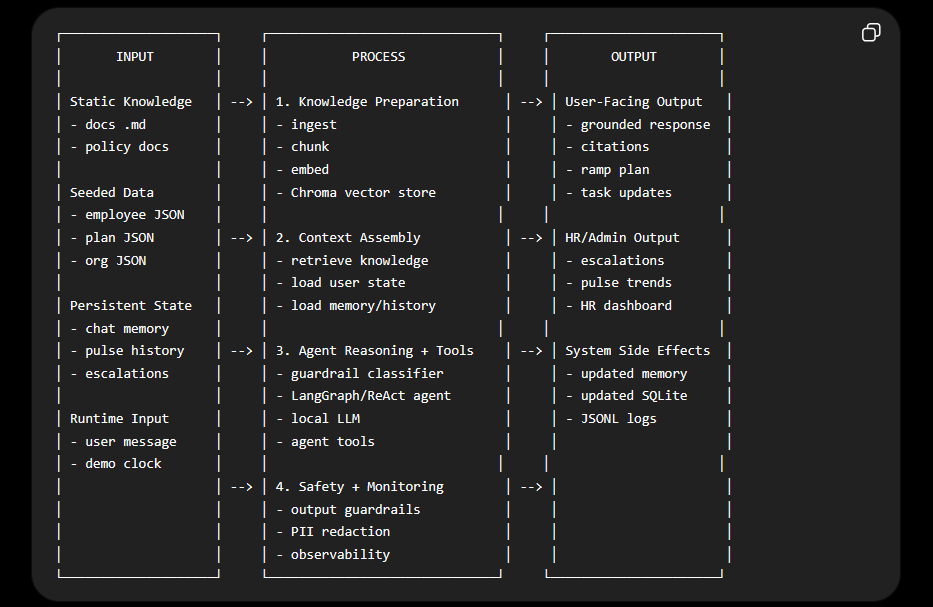
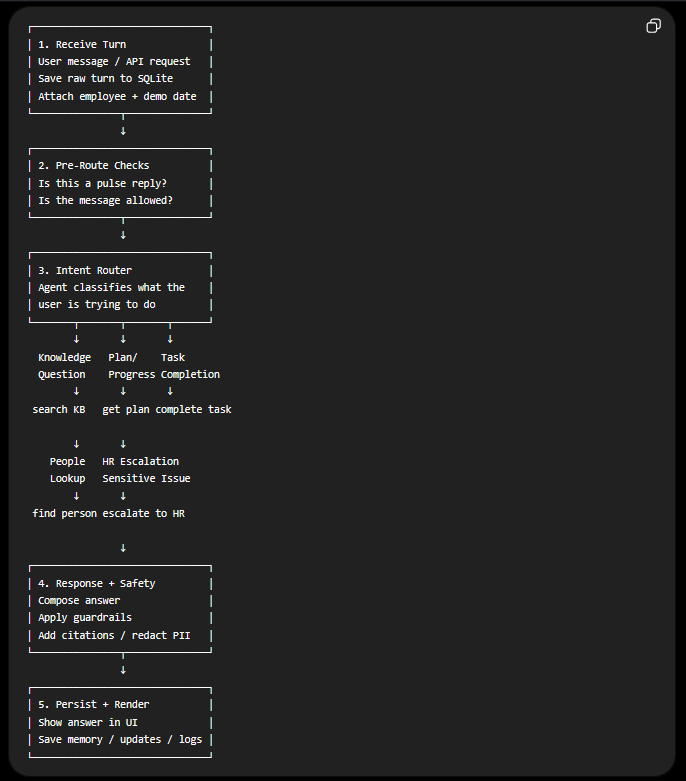

# AISHA Technical Write-Up

AISHA, or AI Support for Hires and Associates, is an educational capstone prototype for a fictionalized BDO onboarding story. It is not affiliated with, endorsed by, or representative of BDO Unibank. All employee records, handbook content, org contacts, metrics, and demo conversations are fictionalized for learning, testing, and demonstration.

## 1. Business Case

To begin with, AISHA treats onboarding as a lived transition rather than a stack of forms. The project began from a feeling we recognized from entering large-company environments ourselves: one of us first experienced that world through a Shopee internship, and later, both of us got into P&G. At first, the exciting part is obvious. The company name feels big, the opportunity feels real, and you want to prove that you belong. However, after that excitement settles, the quieter problem appears: you can be capable and still feel lost because the map is scattered across people, portals, group chats, policy pages, acronyms, and unwritten expectations.

That is the gap AISHA tries to answer. In large organizations, onboarding time is not lost only because new hires cannot find a document. More often, time is lost because the new hire does not know which document matters, which person owns the blocker, or whether a question is "too basic" to ask. Research on onboarding shows that early work tasks shape not only output, but also confidence, learning, and socialization (Ju et al., 2021). Likewise, recent work on graduates points to mentorship as a major need for students moving into professional life (Whalley et al., 2024). AISHA is built around that messy middle: the space between being hired and feeling useful.

In the demo, that new hire is Alyssa Reyes, a Management Trainee and Branch Banking Associate. Her first meaningful goal is not to survive a generic onboarding folder. Instead, her goal is to reach a Day 30 Readiness Check, where she should be ready for supervised branch customer interactions with process awareness, compliance awareness, and enough confidence to know who to ask when something is unclear. This makes the business case sharper because AISHA is not trying to be a general HR chatbot. Rather, it is trying to reduce time-to-ramp for someone learning policies, systems, branch routines, workplace norms, and human relationships at the same time.

In practice, AISHA's value comes from connecting four pieces that are usually separated. First, it gives grounded answers from the fictional handbook and cites the source. Second, it reads and updates the new hire's actual ramp plan. Third, it routes questions to named people, such as IT access, payroll, compliance learning, the manager, or the buddy. Finally, it gives HR support signals without exposing raw private chat transcripts by default. Individually, these features are useful. Together, they turn onboarding from a scavenger hunt into a guided route.

However, the privacy boundary is part of the business case, not a footnote. AI in HR can quickly feel uncomfortable when it becomes a way to watch people rather than help them. Studies on attitudes toward non-human resource management found concerns around AI management, emotional monitoring, and workplace surveillance (Mantello et al., 2021). Similarly, research on AI-driven HRM shows that the field is expanding across analytics, talent management, and workforce planning, which makes governance and trust part of the design problem (Maghsoudi et al., 2023). Because of that, AISHA chooses a support-not-surveillance frame: HR should see delayed milestones, unresolved blockers, concern tags, pulse trends, and suggested actions, but not Alyssa's full private chat by default.

One helpful analogy is a check-engine light. The light does not shame the driver, publish the whole trip, or guess someone's character. Instead, it says that something needs attention before a small issue becomes expensive. AISHA's pulse check-ins work the same way. When a weekly sentiment score is low or declining, the purpose is not to label Alyssa as a risk. The purpose is to suggest a buddy check-in, clarify expectations, unblock access, or file a People Experience escalation before the situation turns into quiet disengagement.

Ultimately, the business case is not "AI for HR because AI is trendy." It is a quieter argument: onboarding is a coordination problem. Alyssa needs the handbook, the plan, the right human owner, and a safe way to say when she is stuck. At the same time, HR needs enough signal to offer help, but not enough detail to police her. AISHA sits between those two needs. It acts less like a judge with a scorecard and more like a patient guide with a map, a clipboard, and a phone directory.

## 2. Methodology

To understand the methodology, it helps to admit the constraint first. We were students building a working agentic AI system, not an enterprise implementation team with a budget, cloud contracts, HRIS access, and months of runway. Because of that, our method was not to choose the most impressive stack possible. Rather, it was to keep asking one practical question: what is the smallest honest system that can prove AISHA's support loop?

From there, we started with Alyssa's journey before choosing the technology. What would she need in her first month? She would need clear answers, a role-based ramp plan, named owners, task updates, a way to escalate, and a weekly check-in that does not feel like a performance review. Human-centered AI work argues that AI systems should support human goals, control, and trust rather than automate blindly (Shneiderman, 2020). That became our north star. AISHA should help Alyssa move through onboarding, not replace the people responsible for helping her.

The first stack decision was local-first AI. A cloud model could have been faster and more powerful, and if this were a funded pilot, we would seriously consider Azure OpenAI, OpenAI, Anthropic, or another enterprise provider. For this capstone, though, cloud AI added cost, internet dependence, and privacy awkwardness. Ollama let us run the model locally, which made the demo easier to rehearse offline and easier to explain: the fictional chat, retrieval, database, and logs stay on the machine unless we deliberately connect them elsewhere.

Next, we chose RAG over fine-tuning. Fine-tuning sounds attractive because it feels like teaching the model to become AISHA. In practice, it was too much work for the value we needed. It would cost more, take longer to iterate, and still would not solve the citation problem cleanly. RAG was simpler and more honest: AISHA retrieves from the fictional handbook, then answers with a citation such as `[source: leave_policy.md]`. This follows the broader idea that retrieval can ground language models in external sources instead of forcing them to answer from memory alone (Lewis et al., 2020, and Gao et al., 2023).

For storage, we made deliberately practical choices. Chroma became the small local filing cabinet for handbook chunks. SQLite became the durable notebook for employees, ramp tasks, escalations, pulse check-ins, and persisted chat messages. We could have used Pinecone, Azure AI Search, PostgreSQL, or a managed data platform, and those would make more sense in production. For a capstone, they would have added infrastructure work without making the demo more honest. Local tools kept the system understandable and easy to reset.

Meanwhile, LangChain and LangGraph handled the agent loop. We chose them because AISHA needed to decide which tool to use: search the handbook, read the plan, complete a task, find a person, or escalate to HR. At the same time, we did not let the model control everything. When a user asks to complete a task, deterministic code checks for ambiguity before updating SQLite. That division matters because the language model is useful for conversation, but ordinary code is safer for state changes, matching, logging, and citation enforcement.

In addition, guardrails were part of the build from the start. The input guardrail checks whether a message is on-topic, off-topic, or a prompt-injection attempt. The output guardrail checks citations and redacts obvious number-shaped private information. These are not perfect safety measures, and we should not pretend they are. Still, the NIST AI Risk Management Framework treats AI as a socio-technical system, where risk depends on the model, the users, the setting, and the lifecycle around it (National Institute of Standards and Technology, 2023). AISHA follows that idea in a small way: define the scope, cite the handbook, avoid repeating sensitive numbers, and keep human escalation available.

For the interface, we chose Streamlit because we needed a working app quickly. A custom React or Next.js interface would look better and scale better, but it would also take time away from the actual agentic behavior. Streamlit let us show both sides of the loop in one place: Alyssa's chat and the HR support dashboard. FastAPI was added so the same guarded pipeline could be reused outside the UI. Observability was added through local JSONL logs because we needed traces, latency, tool use, sources, and errors without turning monitoring into a transcript archive. Finally, Docker made the project less tied to one student's laptop, while still leaving Ollama outside the image because local models are large and hardware-dependent.

In the end, the course module checklist became a scaffold rather than the product itself. Prompt engineering, structured outputs, RAG, memory, guardrails, ReAct, tool use, chat UI, API, observability, and Docker all appear in AISHA, but each one has a job in the story. Structured outputs make pulse and guardrail results predictable. Memory lets Alyssa's progress survive the next turn. Tool use lets the assistant act instead of merely answer. With more time or budget, we would add enterprise identity, PostgreSQL, managed retrieval, consent controls, stronger monitoring, HRIS and LMS integrations, and real role-based access. For this capstone, the goal was smaller: build a complete support loop that we could explain, test, and improve.

## 3. Architecture

To understand AISHA's architecture, it helps to start with the project promise instead of the tools. The system is built around Alyssa Reyes and one practical milestone: her Day 30 Readiness Check for supervised branch customer interactions. Everything in the architecture exists to help her move toward that point with less confusion, more confidence, and clearer support from the people around her.

At a high level, AISHA is a local-first agentic AI system. "Local-first" means the main demo components run on the machine: Ollama for models, Chroma for retrieval, SQLite for state, Streamlit for the interface, and JSONL for logs. "Agentic" means AISHA does more than generate a paragraph. It can retrieve policy context, inspect Alyssa's ramp plan, mark tasks complete, route her to the right person, file an escalation, remember chat history, and feed privacy-preserving support signals into the HR view.

Figure 1 shows the architecture as input, process, and output. The input side combines static knowledge, seeded demo data, persistent state, and runtime input. Static knowledge is the fictional handbook in Markdown files. Seeded data gives the demo its cast: employees, role-based ramp plans, and an org directory. Persistent state is what changes over time, such as chat memory, completed tasks, pulse check-ins, and escalations. Runtime input is the current user message plus the simulated date, which lets the demo show weekly check-ins without waiting weeks in real time.

The process layer turns those inputs into something the agent can use. Ingestion loads the handbook, chunks it, embeds it, and stores it in Chroma. Context assembly retrieves relevant handbook passages, loads Alyssa's state from SQLite, and attaches recent memory. Then the LangChain/LangGraph agent decides which tool path fits the request. A policy question triggers `search_knowledge_base`. A progress question triggers `get_my_plan`. A task update triggers `complete_task`. A routing question triggers `find_person`. A sensitive issue or handbook gap can trigger `escalate_to_hr`.

That tool set is where the business value becomes visible. A normal chatbot might say, "You should ask IT." AISHA can search the IT setup guide, cite it, find the named IT support owner, and file an escalation if needed. A normal checklist app might show Alyssa a list of tasks. AISHA can explain why a task matters for Day 30 readiness, mark the right item complete, and refresh progress. This is why the architecture is not just technical decoration. The pieces are arranged around time-to-ramp.

However, tool use also creates responsibility. If a user says "mark branch practice done," there may be multiple similar tasks in the plan. AISHA should not silently choose the wrong one. The task-completion tool uses deterministic matching and refuses close ambiguous matches before changing state. This small design choice expresses a larger principle: when the system can act, it should also know when to pause.

Figure 2 zooms into one turn. A message enters through Streamlit or FastAPI, gets attached to the employee and simulated date, and then passes through pre-route checks. If the message is a pulse reply, it is scored into sentiment, concern tags, and a short privacy-preserving summary. If it is a normal chat message, the input guardrail checks whether it is on-topic, off-topic, or a prompt-injection attempt before the agent runs.

After the agent composes an answer, output guardrails run as well. If AISHA used the knowledge base, the answer must include `[source: filename.md]` citations. If the model forgets, the guardrail appends retrieved sources. If no source answers the question, AISHA should say the handbook does not cover it and offer escalation. The output pass also redacts obvious number-shaped private information if the assistant tries to repeat it back.

At the same time, AISHA records observability metadata in a JSONL file: route, model names, latency, estimated token counts, tools used, retrieved sources, guardrail category, escalation ID, plan-change status, and errors. It deliberately does not log raw message text. This matters for the privacy thesis because monitoring should help us debug the system and evaluate the demo, not become a hidden transcript archive.

Ultimately, the architecture produces three kinds of output. Alyssa receives grounded answers, citations, plan guidance, task updates, people routing, and a safer way to say she is stuck. HR receives support signals: open escalations, delayed progress, pulse trends, concern tags, and short summaries. The system itself records side effects: updated SQLite state, persisted chat memory, refreshed pulse history, and privacy-conscious JSONL logs. The architecture therefore maps directly to the product thesis: enough support to help, not enough detail to police.

## 4. Experiments and Evaluation

After the architecture was working, our evaluation question became practical: can AISHA's support loop be trusted enough for a student capstone demo? We did not try to prove production readiness. Instead, we tested the contracts that matter for Alyssa's Day 30 story: grounded answers, safe task updates, memory, guardrails, pulse signals, privacy-conscious monitoring, and a reusable API.

| Experiment | What we tested | What passed | What failed | What we learned |
|---|---|---|---|---|
| Guardrail model ablation | `llama3.2:1b` vs `qwen2.5:3b-instruct` on a 15-case topic, multilingual, benefits, off-topic, and injection battery | `qwen2.5:3b-instruct` reached about 14 to 15 out of 15 and handled multilingual support questions better | `llama3.2:1b` scored 8 out of 15 and over-blocked benefits jargon and non-English on-topic messages | The smallest model was not the safest model. A guardrail must protect legitimate support requests, not only reject bad ones |
| Retrieval and citations | Common handbook questions such as leave, SSS deductions, pre-start tasks, MFA, AML, and benefits | Expected sources appeared, and the citation contract `[source: filename.md]` was enforced after generation | This was a small sanity set, not a large retrieval benchmark | RAG worked for the demo scale, but production would need permission filters, freshness checks, and stronger retrieval evaluation |
| Safe task mutation | Completing tasks by numeric ID, fuzzy title, and ambiguous wording | Clear requests updated SQLite, numeric IDs resolved ambiguity, and close matches refused to mutate | Ambiguity scoring is still a heuristic | Agent action needs ordinary deterministic code around it. AISHA should act when clear and pause when unsure |
| Agent, API, and memory loop | Fake tool-calling models, FastAPI dependency overrides, persisted chat messages, and plan changes | Tool calls, source capture, escalations, API responses, and chat memory worked without Ollama | Fake LLM tests do not prove real `llama3.1:8b` answer quality | Offline tests are still valuable because they verify the plumbing around the model |
| Pulse and privacy signals | Simulated-date scheduling, pulse parsing, risk flags, HR dashboard summaries, and observability logs | Pulse timing followed the demo clock, support flags worked, and JSONL logs stored metadata without raw message text | Raw pulse replies are still stored locally for demo drill-down | AISHA can show support signals without making the default HR view a private transcript archive |

The main pattern is that most tests avoid calling Ollama. That was intentional, not a shortcut. Local models are slow, hardware-dependent, and sometimes inconsistent, so we tested parsing, state, API behavior, citation enforcement, pulse logic, and observability with fake LLMs where possible. The real model still matters, but the automated suite gives us a stable way to know whether the support loop around the model is intact.

Ultimately, these experiments do not prove AISHA would reduce time-to-ramp in a real BDO environment. The data is fictionalized, the handbook is small, and there are no real BDO systems, HRIS records, SSO, LMS, or production access controls. What they do prove is narrower but meaningful: the prototype can connect knowledge, action, memory, guardrails, pulse signals, and human escalation in one local loop that supports Alyssa's path toward Day 30 readiness.

## 5. Retrospective

What worked best was starting from Alyssa instead of starting from the model. Once we knew she was a Management Trainee and Branch Banking Associate moving toward a Day 30 Readiness Check, the technical decisions became easier to judge. RAG mattered because she needed grounded answers. Tools mattered because she needed progress updates and human routing. Pulse mattered because a new hire can struggle quietly before anyone notices. The clearest win was that AISHA became more than a chatbot without becoming a huge enterprise system.

What surprised us was how much of the project was not really about making the model smarter. A lot of the trust came from plain engineering choices: citation enforcement, deterministic task matching, SQLite state, fake LLM tests, and logs that avoid raw message text. We expected the agent prompt to be the center of the work, and it was important, but the surrounding contracts did just as much to make AISHA feel responsible. In a way, the model became one part of the system rather than the whole magic trick.

What felt harder than expected was keeping the product humane while still making it measurable. It is easy to say "support signals, not surveillance," but harder to design every screen, log, pulse summary, and escalation around that promise. The pulse feature especially forced us to be careful. We wanted AISHA to notice when Alyssa might need help, but we did not want to turn her private uncertainty into a performance label. That tension made the project more real, because HR AI is not only a technical problem. It is also a trust problem.

With more time or budget, we would improve the parts that a real organization would care about first: consent, access control, retention rules, SSO, HRIS and LMS integrations, stronger retrieval evaluation, better UI design, and real user testing with new hires or HR mentors. We would also move from SQLite to a production database, add role-based permissions, and test whether AISHA actually reduces time-to-ramp instead of only demonstrating the loop. The next version should measure outcomes, not just capabilities.

What we would not overbuild again is infrastructure before the story is clear. It was tempting to imagine dashboards, integrations, analytics, and production deployment too early. In hindsight, the better move was to keep returning to one question: does this help Alyssa take the next useful step? If the answer was no, it could wait. That lesson may be the most useful part of the project. Agentic AI does not need to feel huge to be meaningful. It needs to be grounded, careful, and pointed at a real human moment.

## References

Gao, Y., Xiong, Y., Gao, X., Jia, K., Pan, J., Bi, Y., Dai, Y., Sun, J., Wang, M., & Wang, H. (2023). *Retrieval-augmented generation for large language models: A survey*. arXiv. https://arxiv.org/abs/2312.10997

Ju, A., Sajnani, H., Kelly, S., & Herzig, K. (2021). *A case study of onboarding in software teams: Tasks and strategies*. arXiv. https://arxiv.org/abs/2103.05055

Lewis, P., Perez, E., Piktus, A., Petroni, F., Karpukhin, V., Goyal, N., Kuttler, H., Lewis, M., Yih, W., Rocktaschel, T., Riedel, S., & Kiela, D. (2020). Retrieval-augmented generation for knowledge-intensive NLP tasks. *Advances in Neural Information Processing Systems, 33*, 9459-9474. https://arxiv.org/abs/2005.11401

Maghsoudi, M., Kamrani Shahri, M., Agha Mohammad Ali Kermani, M., & Khanizad, R. (2023). *Mapping the landscape of AI-driven human resource management: A social network analysis of research collaboration*. arXiv. https://arxiv.org/abs/2308.09798

Mantello, P., Ho, M.-T., Nguyen, M.-H., & Vuong, Q.-H. (2021). *My boss the computer: A Bayesian analysis of socio-demographic and cross-cultural determinants of attitude toward the non-human resource management*. arXiv. https://arxiv.org/abs/2102.04213

National Institute of Standards and Technology. (2023). *Artificial intelligence risk management framework (AI RMF 1.0)* (NIST AI 100-1). https://doi.org/10.6028/NIST.AI.100-1

Shneiderman, B. (2020). Human-centered artificial intelligence: Reliable, safe & trustworthy. *International Journal of Human-Computer Interaction, 36*(6), 495-504. https://doi.org/10.1080/10447318.2020.1741118

Whalley, J., Imbulpitiya, A., Clear, T., & Ogier, H. (2024). *From student to working professional: A graduate survey*. arXiv. https://arxiv.org/abs/2410.07560
